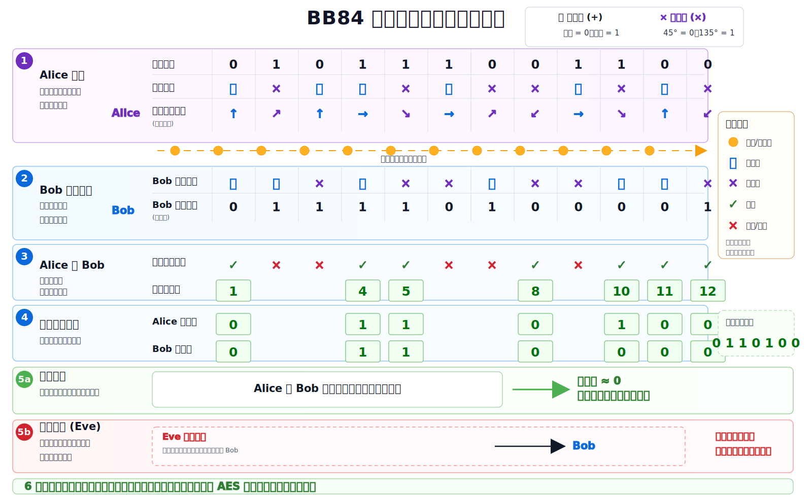

# BB84 量子密钥分发协议详解

BB84 是最经典的量子密钥分发协议之一，由 Charles Bennett 和 Gilles Brassard 在 1984 年提出。它的目标不是直接加密明文，而是在 Alice 和 Bob 之间建立一段共享随机密钥。后续通信可以用这段密钥配合 AES、一次一密或其他对称加密方案。

本文配套图解如下：



## 1. BB84 解决什么问题

经典加密通信通常分两步：

1. 双方先协商一个共享密钥。
2. 用共享密钥加密真实消息。

难点在第一步：如果 Alice 和 Bob 从来没有见过面，如何在不安全信道上协商出只有他们知道的密钥？

经典互联网常用 RSA、Diffie-Hellman、ECDH 等方法。这些方法的安全性依赖计算复杂度假设，例如“分解大整数很难”或“离散对数很难”。量子密钥分发 QKD 的思想不同：

```text
不依赖攻击者算力不够，
而是依赖量子测量会扰动态、未知量子态不可克隆、非正交态不可完美区分。
```

BB84 给 Alice 和 Bob 一种检测窃听的机制：如果 Eve 在量子信道中截获并测量光子，她会不可避免地引入额外错误。Alice 和 Bob 通过公开抽样比对一部分密钥位，就能估计误码率；误码率过高时，直接丢弃这轮密钥。

## 2. 参与者和信道

BB84 有三个常见角色：

- **Alice**：发送方，准备随机比特和随机量子态。
- **Bob**：接收方，随机选择测量基并测量量子态。
- **Eve**：潜在窃听者，可能截获、测量、重发量子态。

BB84 使用两类信道：

| 信道 | 作用 | 是否需要保密 |
| --- | --- | --- |
| 量子信道 | 传输光子/量子态 | 不要求保密，但 Eve 的干扰可被检测 |
| 经典公开信道 | 比较基、抽样估计误码率、纠错协商 | 不要求保密，但必须认证 |

最后一句很重要：BB84 仍然需要认证的经典信道。否则 Eve 可以冒充 Alice 或 Bob 发消息，形成中间人攻击。

## 3. 两组基：直线基和对角基

BB84 通常用光子偏振来讲解。Alice 用两组互不兼容的测量基编码比特：

| 基 | 记号 | bit 0 | bit 1 |
| --- | --- | --- | --- |
| 直线基 | `+` | 垂直偏振 | 水平偏振 |
| 对角基 | `×` | 45° 偏振 | 135° 偏振 |

不同教材可能把 0/1 与方向的对应关系反过来；这只是编码约定，不影响协议本质。重要的是：

```text
同一组基内的两个状态可以可靠区分；
不同组基之间互不兼容，用错基测量会得到随机结果。
```

用量子态写，可以把直线基记作：

```text
|0⟩, |1⟩
```

把对角基记作：

```text
|+⟩ = (|0⟩ + |1⟩) / √2
|-⟩ = (|0⟩ - |1⟩) / √2
```

如果 Alice 用直线基发送 `|0⟩`，Bob 也用直线基测量，就会确定得到 0。  
如果 Bob 用对角基测量，就会随机得到 0 或 1。

## 4. 协议全过程

### 4.1 Alice 随机准备

Alice 为每个位置随机选择：

- 一个比特：`0` 或 `1`
- 一个基：`+` 或 `×`

例如：

```text
随机比特：0 1 0 1 1 1 0 0 1 1 0 0
选择的基：+ × + + × + × × + × + ×
```

Alice 根据“比特 + 基”的组合准备光子偏振态，并通过量子信道发给 Bob。

### 4.2 Bob 随机测量

Bob 不知道 Alice 每个位置用了哪组基，所以他也为每个收到的光子随机选择测量基：

```text
Bob 的基：+ + × + × × + × × + + ×
```

规则：

- Bob 的基和 Alice 的基一致：测量结果理想情况下等于 Alice 的比特。
- Bob 的基和 Alice 的基不一致：测量结果随机，不能用于密钥。

### 4.3 公开比较基

量子态传输和测量完成后，Alice 和 Bob 通过公开经典信道公布自己每个位置使用的基。

他们只公开基，不公开比特。

例如：

```text
Alice 的基：+ × + + × + × × + × + ×
Bob 的基：  + + × + × × + × × + + ×
```

基一致的位置保留：

```text
1, 4, 5, 8, 10, 11, 12
```

基不一致的位置丢弃。

这个步骤叫：

```text
sifting / basis reconciliation / 筛选
```

筛选后得到的是 **原始密钥 raw key**，还不是最终安全密钥。

### 4.4 抽样估计误码率

Alice 和 Bob 从保留下来的位置中随机挑一部分，公开对应比特进行比对。

如果没有窃听且信道噪声很低，Alice 和 Bob 在基一致位置上的比特应该一致。

如果发现误码率很高，说明可能存在：

- Eve 窃听
- 信道噪声过大
- 设备异常
- 实现存在攻击面

这轮密钥应丢弃。

误码率通常称为：

```text
QBER = Quantum Bit Error Rate
```

### 4.5 纠错和隐私放大

即使没有 Eve，真实信道也可能有少量噪声。因此 Alice 和 Bob 需要做：

1. **信息协调 / 纠错**：让双方 raw key 变得一致。
2. **隐私放大**：把 raw key 压缩成更短的 final key，降低 Eve 可能掌握的信息。

最终得到：

```text
更短但更安全的最终密钥
```

## 5. Eve 为什么会被发现

最简单的攻击叫 intercept-resend：

1. Eve 截获 Alice 发来的光子。
2. Eve 随机选择 `+` 或 `×` 基测量。
3. Eve 根据自己的测量结果重新制备一个光子发给 Bob。

问题是 Eve 不知道 Alice 用的基。

如果 Eve 选对基，她不会引入错误。  
如果 Eve 选错基，她的测量结果随机，并且她重发的量子态也会偏离 Alice 原始状态。

在 Alice 和 Bob 基一致的位置中，Eve 引入错误的概率约为：

```text
P(Eve 选错基) × P(Bob 得到错误结果 | Eve 选错基)
= 1/2 × 1/2
= 1/4
```

也就是说，在理想 intercept-resend 攻击下，筛选后密钥位的误码率大约会上升到 25%。

这就是 BB84 的安全直觉：

```text
Eve 想获得信息，就必须测量；
测量会扰动态；
扰动会表现为 Alice 和 Bob 的误码率上升。
```

## 6. BB84 依赖的量子原理

### 6.1 非正交态不可完美区分

直线基和对角基中的状态不是同一组可同时可靠区分的状态。Bob 或 Eve 如果不知道正确基，就不可能完美判断 Alice 发的是哪个状态。

### 6.2 测量会扰动态

对一个未知量子态使用错误基测量，会把状态投影到测量基上，破坏原始态。

例如 Alice 发送 `|0⟩`，Eve 用对角基测量，会得到 `|+⟩` 或 `|-⟩`。如果 Eve 再把这个结果发给 Bob，Bob 用直线基测量时就可能得到错误比特。

### 6.3 未知量子态不可克隆

Eve 不能完美复制 Alice 发来的未知量子态，然后一份留给自己、一份原样发给 Bob。这由不可克隆定理保证。

这使得“悄悄复制以后慢慢研究”的经典窃听方式在量子信道中不可行。

## 7. BB84 和经典密钥交换的异同

| 维度 | 经典密钥交换 | BB84 / QKD |
| --- | --- | --- |
| 安全基础 | 计算困难问题 | 量子测量扰动和不可克隆 |
| 抵抗未来算力 | 依赖具体算法假设 | 理论上不依赖攻击者计算能力 |
| 是否需要认证 | 需要 | 也需要 |
| 是否直接传输明文 | 不直接 | 不直接 |
| 是否生成密钥 | 是 | 是 |
| 主要工程挑战 | 算法、协议实现、密钥管理 | 光学/硬件、信道损耗、设备安全、认证 |
| 被动窃听是否可检测 | 通常不可检测 | 理想情况下可通过误码率检测 |

BB84 不是“量子版 RSA”。它更像是一种物理层密钥分发机制。它解决的是密钥生成和窃听检测问题，而不是直接替代所有经典密码协议。

## 8. BB84 不是万能的

学习 BB84 时也要知道它的边界：

- 它不能防止拒绝服务攻击。Eve 可以阻断信道。
- 它需要认证经典信道，否则可能被中间人攻击。
- 真实设备有 side-channel，例如探测器漏洞、光源强度问题。
- 传输距离受光纤损耗、探测效率和中继技术限制。
- 最终系统安全还依赖实现细节、随机数质量和密钥管理。

所以更准确的说法是：

```text
BB84 提供了一种基于量子物理的密钥分发和窃听检测机制；
工程上仍需完整安全系统设计。
```

## 9. 和本仓库代码的关系

本仓库的综合场景中有一个函数：

```python
bb84_sifted_key(raw_bits: str, key_length: int = 12)
```

它位于：

```text
src/quantum_samples/advanced_workflow.py
```

这个函数没有模拟完整光学信道，也没有模拟真实 Eve、纠错和隐私放大。它做的是 BB84 中最核心、最适合入门理解的一步：

```text
Alice 随机 bit + 随机 basis
Bob 随机 basis
双方保留 basis 一致的位置
得到 sifted key
```

你可以把它当作“basis sifting 思想”的代码化演示。

## 10. 最小伪代码

```text
Alice:
  对每个位置 i:
    随机生成 bit a_i
    随机选择基 A_i ∈ {+, ×}
    根据 (a_i, A_i) 发送量子态

Bob:
  对每个位置 i:
    随机选择基 B_i ∈ {+, ×}
    测量收到的量子态，得到 b_i

公开讨论:
  Alice 公布 A_i
  Bob 公布 B_i
  保留 A_i == B_i 的位置
  丢弃 A_i != B_i 的位置

安全检查:
  随机公开一部分保留位的 bit
  估计 QBER
  如果 QBER 太高，丢弃整轮密钥

后处理:
  信息协调 / 纠错
  隐私放大
  得到最终共享密钥
```

## 11. 一个小例子

| 位置 | Alice bit | Alice 基 | Bob 基 | Bob bit | 是否保留 |
| --- | --- | --- | --- | --- | --- |
| 1 | 0 | `+` | `+` | 0 | 保留 |
| 2 | 1 | `×` | `+` | 随机 | 丢弃 |
| 3 | 0 | `+` | `×` | 随机 | 丢弃 |
| 4 | 1 | `+` | `+` | 1 | 保留 |
| 5 | 1 | `×` | `×` | 1 | 保留 |

筛选后 raw key：

```text
Alice: 0 1 1
Bob:   0 1 1
```

如果他们抽样比对发现误码率低，就继续纠错和隐私放大。

## 12. 推荐学习顺序

如果你刚学量子计算，可以按这个顺序理解 BB84：

1. 先理解 `|0⟩`、`|1⟩`、`|+⟩`、`|-⟩`。
2. 理解为什么用正确基测量是确定的，用错误基测量是随机的。
3. 理解 Alice 和 Bob 为什么只公开基，不公开 bit。
4. 理解为什么保留基一致的位置。
5. 理解 Eve 的 intercept-resend 攻击为什么引入约 25% 误码率。
6. 理解 raw key 为什么还需要纠错和隐私放大。
7. 最后再学习真实 QKD 的设备安全、诱骗态、认证和密钥管理。

BB84 的核心可以压缩成一句话：

```text
用互不兼容的量子基传输随机信息；任何试图获取信息的测量都会留下可统计检测的扰动。
```
