# Grover 算法详解：从无结构搜索到振幅放大

Grover 算法是最经典的量子算法之一。它解决的不是“排序好的数据库查找”，而是更抽象的 **无结构搜索**：

```text
给定 N 个候选，其中有 M 个是答案。
我们能调用一个 oracle 判断某个候选是否为答案。
目标是在尽量少的 oracle 查询次数内找到答案。
```

如果你遇到缩略语，可以先查 [常用词汇表](glossary_zh.md)，尤其是 [oracle](glossary_zh.md#oracle)、[diffuser](glossary_zh.md#diffuser)、[amplitude](glossary_zh.md#amplitude)、[bitstring](glossary_zh.md#bitstring)。

一句话总结：

```text
Grover 算法不是“把所有答案并行算出来然后直接读出”；
它是让目标态的振幅通过干涉逐步变大，
最后测量时更大概率读到目标答案。
```

## 1. Grover 解决什么问题

设有 `N = 2^n` 个候选，每个候选用一个 `n` 位 bitstring 表示：

```text
00...0
00...1
...
11...1
```

有一个函数：

```text
f(x) = 1  如果 x 是目标
f(x) = 0  如果 x 不是目标
```

经典搜索如果没有结构可利用，平均需要检查约：

```text
N / M
```

个候选。Grover 在理想情况下只需要约：

```text
O(sqrt(N / M))
```

次 oracle 查询。

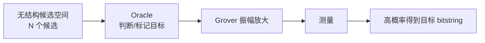

这里的重点是 **平方加速**。如果经典要查 `1,000,000` 个候选，Grover 理想上大约需要 `1,000` 次 oracle 查询量级；这很强，但不是指数加速。

## 2. 为什么不能直接“并行读出答案”

量子电路可以把所有候选放进叠加态：

```text
|s⟩ = 1/sqrt(N) * Σ_x |x⟩
```

这看起来像“同时尝试所有 x”，但测量时只会得到一个随机 bitstring。初始均匀叠加中，每个候选概率一样：

```text
每个候选概率 = 1 / N
```

如果直接测量，目标并不会自动跳出来。Grover 的工作是改变振幅分布，让目标态概率变大。

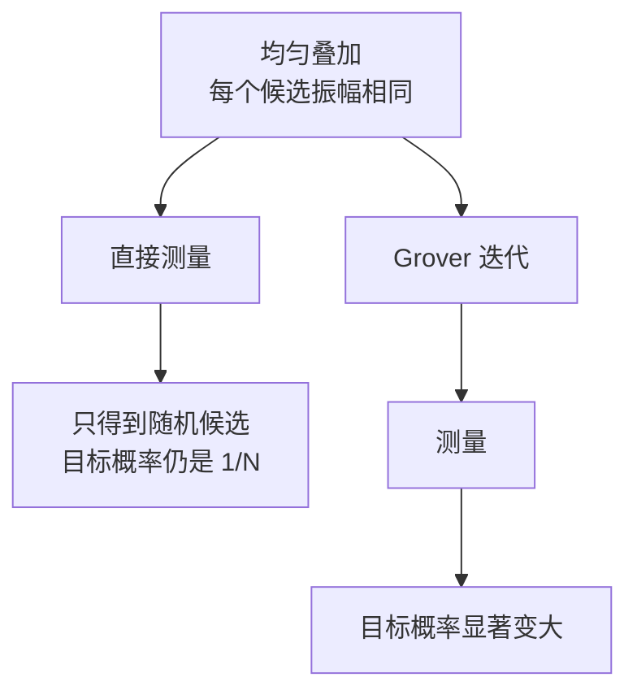

## 3. 两个核心部件：oracle 和 diffuser

Grover 每轮迭代由两个反射组成。

### 3.1 Phase oracle：给目标态加负号

最常见的 Grover oracle 是 phase oracle：

```text
|x⟩ -> -|x⟩   如果 x 是目标
|x⟩ ->  |x⟩   如果 x 不是目标
```

它不直接告诉你答案，只是在目标态上写入一个相位差。

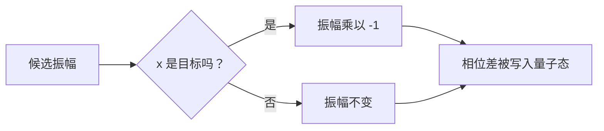

这个负号本身不能直接测出来。它真正的价值在于后续 diffuser 会利用这个相位差产生干涉。

### 3.2 Diffuser：围绕平均振幅反射

Diffuser 的直觉是：

```text
把每个振幅 a 变成 2 * average - a
```

所以它也叫 inversion about the mean，围绕平均值反转。

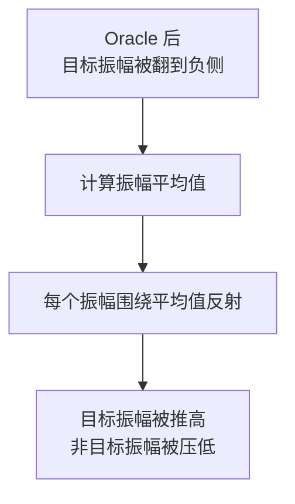

在数学上，如果初始均匀态是 `|s⟩`，diffuser 可以写成：

```text
D = 2|s⟩⟨s| - I
```

Grover 一轮迭代就是：

```text
G = D * O
```

其中 `O` 是 oracle，`D` 是 diffuser。

## 4. 2 qubit 示例：4 个候选中找 `10`

本仓库的 Grover 示例就是这个最小场景：

```text
候选空间：00, 01, 10, 11
目标：10
N = 4, M = 1
```

初始时，先对两个 qubit 都施加 Hadamard，得到均匀叠加：

```text
|s⟩ = 1/2(|00⟩ + |01⟩ + |10⟩ + |11⟩)
```

### 4.1 振幅如何变化

| 阶段 | `00` | `01` | `10` 目标 | `11` | 说明 |
| --- | ---: | ---: | ---: | ---: | --- |
| 初始均匀叠加 | `0.5` | `0.5` | `0.5` | `0.5` | 每个概率 `0.25` |
| oracle 后 | `0.5` | `0.5` | `-0.5` | `0.5` | 目标被加负相位 |
| 平均振幅 |  |  | `0.25` |  | `(0.5 + 0.5 - 0.5 + 0.5) / 4` |
| diffuser 后 | `0` | `0` | `1` | `0` | 围绕平均值反射 |

最后测量时：

```text
P(10) = |1|^2 = 1
```

所以在理想模拟器里，一轮 Grover 就能稳定得到 `10`。

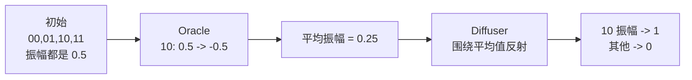

这也是为什么入门教材常用 4 个候选讲 Grover：数字非常干净，能完整看见振幅放大的机制。

## 5. 几何视角：Grover 是在二维平面里旋转

虽然候选空间可能很大，但 Grover 的核心运动可以压缩到二维平面：

- `|w⟩`：所有目标态组成的方向。
- `|r⟩`：所有非目标态组成的方向。

初始均匀态可以写成：

```text
|s⟩ = sin(θ)|w⟩ + cos(θ)|r⟩
```

其中：

```text
sin(θ) = sqrt(M / N)
```

每次 Grover 迭代会把状态向目标方向旋转大约 `2θ`。第 `k` 次迭代后，目标概率约为：

```text
P_success(k) = sin^2((2k + 1)θ)
```

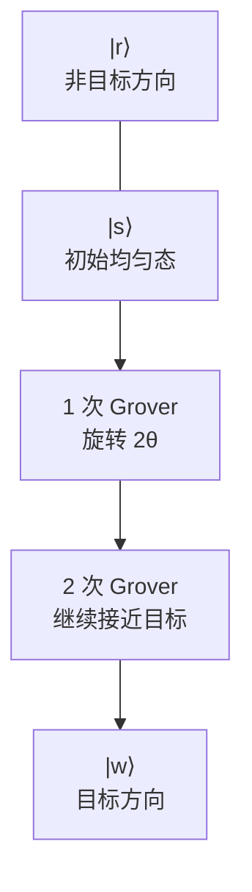

这个图不是严格坐标图，但表达了关键直觉：Grover 不是神奇地“读出答案”，而是在目标方向上旋转量子态。

## 6. 最优迭代次数

如果目标数量 `M` 已知，常用估计是：

```text
k ≈ floor((π / 4) * sqrt(N / M))
```

更精细地，从 `θ = arcsin(sqrt(M/N))` 出发：

```text
k ≈ floor(π / (4θ) - 1/2)
```

例子：

| 候选数 `N` | 目标数 `M` | `sqrt(N/M)` | Grover 迭代量级 |
| ---: | ---: | ---: | ---: |
| 4 | 1 | 2 | 1 |
| 16 | 1 | 4 | 3 左右 |
| 1,024 | 1 | 32 | 25 左右 |
| 1,000,000 | 1 | 1,000 | 约 785 |

迭代不是越多越好。超过最佳点后，状态会继续旋转并离开目标方向，成功概率反而下降。这叫 overshooting。

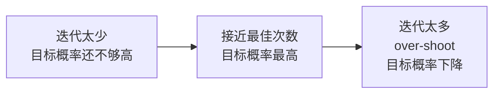

## 7. 多个目标时会怎样

如果有 `M` 个目标，oracle 会给所有目标态加负号。Grover 放大的不是某一个固定 bitstring，而是整个目标子空间。

```text
目标集合 W = {x | f(x)=1}
```

测量后，你会得到其中一个目标。目标越多，初始目标总概率 `M/N` 越大，所需迭代次数越少。

但如果 `M` 不知道，最佳迭代次数也不知道。实际算法会使用变体，例如随机迭代次数、量子计数、振幅估计等方法。

## 8. 和本仓库 Qiskit 示例的对应关系

本仓库核心代码在 [src/quantum_samples/demos.py](../src/quantum_samples/demos.py)。

### 8.1 构造 phase oracle

代码：

```python
def phase_oracle(bitstring: str) -> QuantumCircuit:
    qubits = len(bitstring)
    circuit = QuantumCircuit(qubits, name=f"oracle_{bitstring}")
    for qubit, bit in enumerate(reversed(bitstring)):
        if bit == "0":
            circuit.x(qubit)

    if qubits == 1:
        circuit.z(0)
    else:
        circuit.h(qubits - 1)
        circuit.mcx(list(range(qubits - 1)), qubits - 1)
        circuit.h(qubits - 1)

    for qubit, bit in enumerate(reversed(bitstring)):
        if bit == "0":
            circuit.x(qubit)
    return circuit
```

思路：

1. 对目标 bitstring 中为 `0` 的位置临时加 `X`，把目标态映射到 `|11...1⟩`。
2. 用多控制门给 `|11...1⟩` 加相位负号。
3. 再把前面的 `X` 还原。

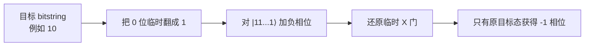

这里用 `reversed(bitstring)` 是为了处理 Qiskit 的 qubit 编号和显示 bitstring 顺序。读者如果改目标字符串，要记得这一点。

### 8.2 构造 Grover 电路

代码：

```python
def grover_search_circuit(target: str = "10") -> QuantumCircuit:
    oracle = phase_oracle(target)
    circuit = QuantumCircuit(len(target), len(target), name=f"grover_{target}")
    circuit.h(range(len(target)))
    circuit.compose(grover_operator(oracle), inplace=True)
    circuit.measure(range(len(target)), range(len(target)))
    return circuit
```

对应步骤：

| 代码 | 算法含义 |
| --- | --- |
| `circuit.h(...)` | 准备均匀叠加 |
| `phase_oracle(target)` | 标记目标态 |
| `grover_operator(oracle)` | 把 oracle 和 diffuser 组合成一轮 Grover |
| `measure(...)` | 从放大后的分布中采样答案 |

运行：

```bash
python examples/06_grover_search.py
```

典型结果会显示 `found` 接近目标：

```text
target = "10"
found  = "10"
```

## 9. Diffuser 的电路结构

Diffuser 公式是：

```text
D = 2|s⟩⟨s| - I
```

因为：

```text
|s⟩ = H^⊗n |0...0⟩
```

所以可以把 diffuser 拆成：

```text
H^⊗n
对 |0...0⟩ 做相位反射
H^⊗n
```

常见等价写法是：

```text
D = H^⊗n * (2|0...0⟩⟨0...0| - I) * H^⊗n
```

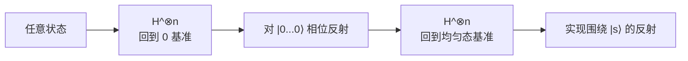

Qiskit 的 `grover_operator(oracle)` 已经帮我们把 oracle、diffuser 和必要的门组合起来。本仓库为了教学透明，只自己写 oracle，diffuser 使用 Qiskit 的标准构造。

## 10. Grover 为什么是平方加速

每次 Grover 迭代都把状态向目标方向旋转一个固定角度，而不是把概率一点点线性增加。初始目标方向的角度大约是：

```text
θ ≈ sqrt(M / N)
```

要旋转到接近目标方向，需要大约：

```text
1 / θ ≈ sqrt(N / M)
```

次迭代。

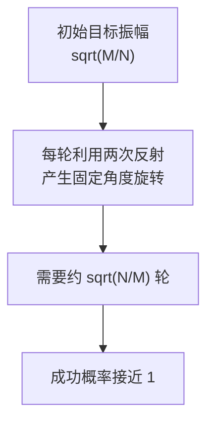

这是 Grover 加速的根源。它不是指数级，是平方级；但对大规模无结构搜索仍然非常有意义。

如果想把 Grover 的平方加速和 Shor 的多项式时间击穿放在一起比较，可以阅读 [shor_grover_speedup_zh.md](shor_grover_speedup_zh.md)。

## 11. Grover 的局限

学习 Grover 时很容易有几个误解。

### 11.1 Grover 不是万能加速器

Grover 适合可以写成 oracle 搜索的问题。它不能自动加速所有计算任务，也不能替代排序、动态规划、图算法等所有经典结构化算法。

### 11.2 Oracle 成本不能忽略

理论复杂度常说“oracle 查询次数”，但真实电路里 oracle 本身可能很贵。如果 oracle 很深，量子门数、误差和纠错成本都会上升。

### 11.3 数据加载不是免费的

如果问题是“从一个经典数据库里找记录”，把数据库高效装入量子态本身就是难题。Grover 的理论模型通常假设 oracle 已经能被量子电路调用。

### 11.4 噪声会破坏振幅放大

Grover 需要多轮相干干涉。真实硬件上的退相干、门误差和读出误差会降低成功率。规模越大、迭代越多，对容错能力要求越高。

### 11.5 加密影响是平方加速，不是 Shor 式击穿

Grover 对对称密钥搜索给平方加速，因此常说后量子时代高价值场景要使用更长密钥，例如 AES-256。但它不像 Shor 算法攻击 RSA/ECC 那样直接利用代数结构把问题变成多项式时间。

## 12. Grover 与振幅放大的关系

Grover 是更一般的 amplitude amplification 的特例。只要你有：

1. 一个能制备初始状态的过程 `A`。
2. 一个能识别好答案的 oracle。
3. 一个能围绕初始状态反射的操作。

就可以用类似 Grover 的反射组合来放大好答案概率。

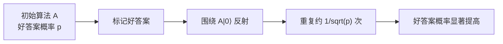

所以 Grover 不只是“搜索算法”，也是量子算法设计里非常重要的概率放大模板。

## 13. 如何继续学习

建议按下面顺序巩固：

1. 先运行 [examples/06_grover_search.py](../examples/06_grover_search.py)。
2. 把 target 从 `"10"` 改成 `"11"`、`"00"`，观察 counts。
3. 阅读 [docs/example_walkthrough_zh.md](example_walkthrough_zh.md) 的 Grover 小节。
4. 阅读 [docs/advanced_workflow_zh.md](advanced_workflow_zh.md) 中路线选择的 Grover 场景。
5. 把候选空间扩展到 3 qubits，尝试理解为什么最佳迭代次数不再是 1。
6. 对照 [docs/post_quantum_cryptography_zh.md](post_quantum_cryptography_zh.md) 中 Grover 对对称密码的影响。

## 14. 课后习题

1. Grover 解决的是结构化搜索还是无结构搜索？
2. 为什么初始均匀叠加不能直接测出答案？
3. Phase oracle 对目标态做了什么？
4. Diffuser 的“围绕平均值反射”是什么意思？
5. 4 个候选、1 个目标时，为什么一轮 Grover 可以把目标概率推到 1？
6. 如果 `N = 16, M = 1`，Grover 迭代次数大约是什么量级？
7. 为什么 Grover 迭代太多会导致成功概率下降？
8. 多目标场景下，目标越多，迭代次数会增加还是减少？
9. 为什么 oracle 的实现成本会影响 Grover 的实际价值？
10. Grover 对 AES 的影响和 Shor 对 RSA 的影响有什么本质不同？

## 15. 参考答案

1. 无结构搜索，或者能被 oracle 判断目标的搜索问题。
2. 因为测量只返回一个随机候选；初始均匀叠加中每个候选概率相同。
3. 给目标态加负相位，非目标态不变。
4. 对每个振幅 `a`，变成 `2 * average - a`。
5. 初始振幅都是 `0.5`，目标经 oracle 变成 `-0.5`，平均值为 `0.25`，反射后目标变成 `1`，其他变成 `0`。
6. 约 `sqrt(16) = 4` 的常数倍，常用估计大约 3 次。
7. Grover 在二维平面里旋转，超过目标方向后会转过头。
8. 减少。因为初始目标子空间概率 `M/N` 更大。
9. 理论查询次数不包含 oracle 内部门数；真实电路里 oracle 越深，噪声、时间和纠错成本越高。
10. Grover 给无结构搜索平方加速，对 AES 主要等效降低暴力搜索安全强度；Shor 利用 RSA 的代数结构，可在容错量子计算机上多项式时间分解整数。

## 16. 核心结论

1. **Grover 的核心是振幅放大**：oracle 写入相位差，diffuser 把相位差转成概率差。
2. **它给平方加速**：从 `O(N/M)` 降到 `O(sqrt(N/M))`。
3. **它不是直接读出所有并行计算结果**：测量仍然只给一个样本。
4. **迭代次数很重要**：太少不够，太多会 overshoot。
5. **真实价值取决于 oracle**：oracle 的电路成本、数据加载、噪声和纠错都决定实际可行性。
