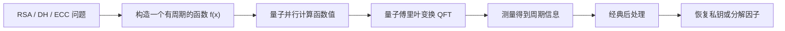
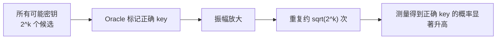
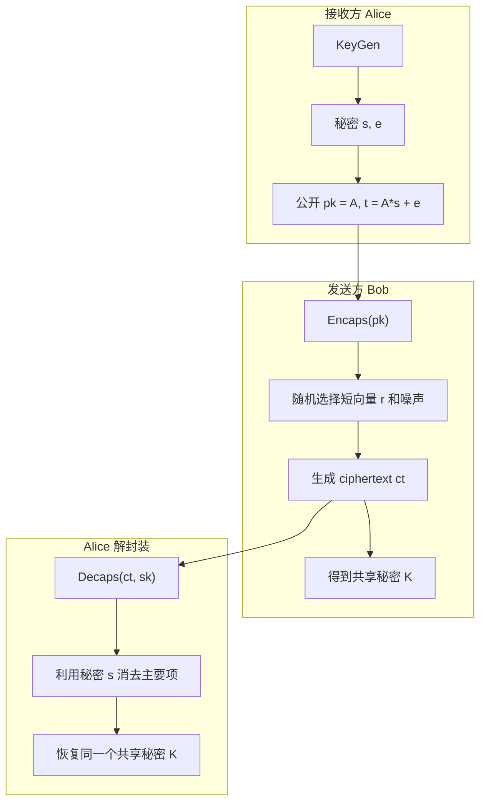
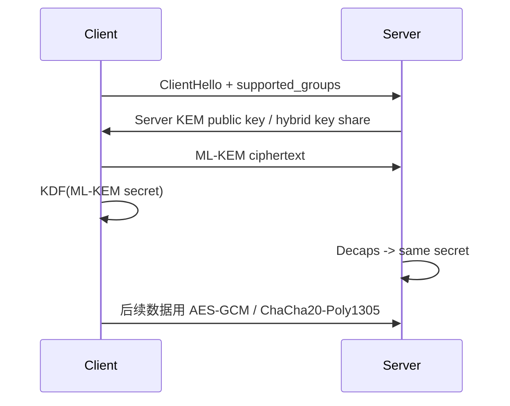
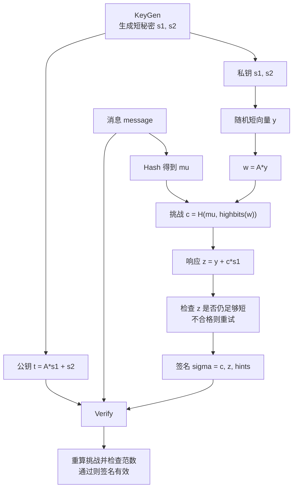
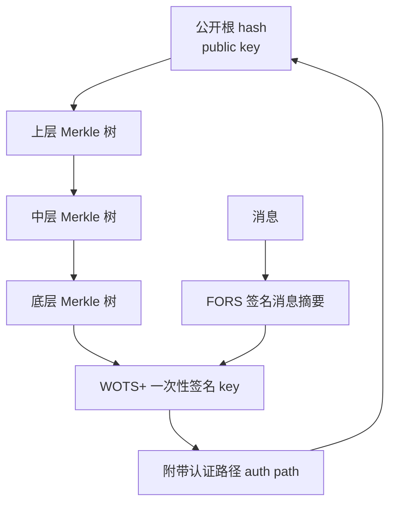
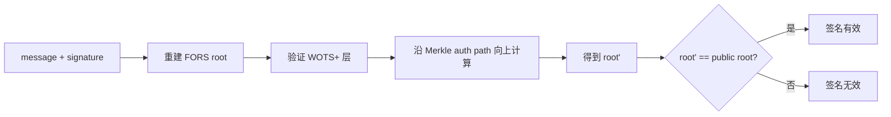
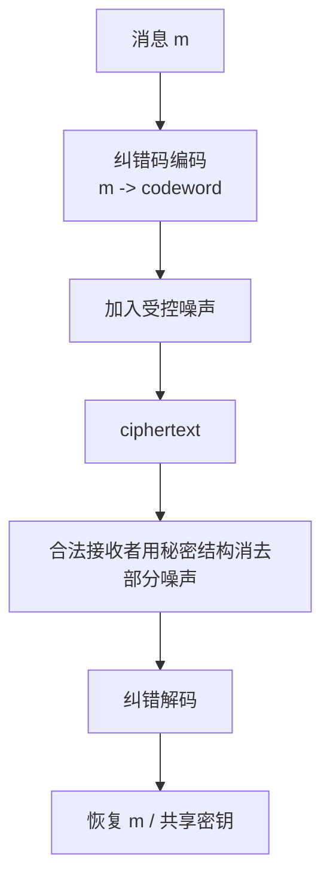
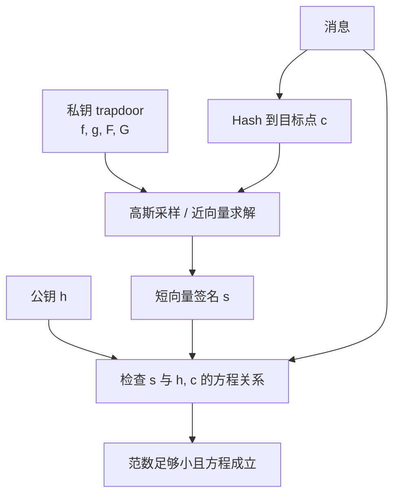
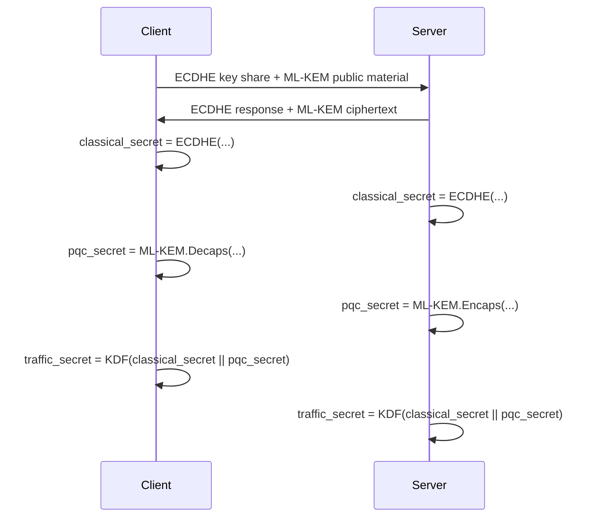

# 后量子时代（PQC）对当前密码算法的影响与迁移指南

本文评估量子计算，尤其是 Shor 算法和 Grover 算法，对当前主流密码算法的影响，并总结截至 **2026-06-04** 的主要标准化进展，包括美国 NIST、NSA CNSA 2.0、欧洲 EU/ENISA/ETSI 相关路线和规范。

如果你遇到缩略语，可以先查 [常用词汇表](glossary_zh.md)，例如 [PQC](glossary_zh.md#pqc)、[CRQC](glossary_zh.md#crqc)、[KEM](glossary_zh.md#kem)、[AEAD](glossary_zh.md#aead)、[ML-KEM](glossary_zh.md#ml-kem)、[ML-DSA](glossary_zh.md#ml-dsa)、[SLH-DSA](glossary_zh.md#slh-dsa)。

一句话总结：

```text
RSA、DH、ECDH、DSA、ECDSA、EdDSA 等公钥算法需要迁移；
AES、HMAC、SHA-2/SHA-3 等对称与哈希算法总体仍可继续使用，但高安全场景应提高安全强度并采用更长密钥/摘要；
迁移重点是密钥交换、证书/签名、PKI、TLS、VPN、代码签名、固件签名和长期保密数据。
```

## 1. 为什么会有 PQC 问题

当前互联网安全大量依赖公钥密码：

- TLS 握手中的 ECDHE / DH / RSA
- 证书中的 RSA / ECDSA / EdDSA 签名
- SSH、VPN、S/MIME、PGP、JWT、代码签名、固件签名
- 区块链交易签名
- 软件包签名与供应链签名

经典计算机上，RSA 和 ECC 的安全性依赖某些数学问题很难：

| 算法类型 | 依赖问题 | 典型算法 |
| --- | --- | --- |
| RSA | 大整数分解困难 | RSA encryption, RSA signature |
| DH / DSA | 有限域离散对数困难 | DH, DSA |
| ECC | 椭圆曲线离散对数困难 | ECDH, ECDSA, EdDSA |

量子计算机如果足够大且具备纠错能力，Shor 算法可以高效解决整数分解和离散对数问题。因此这些公钥算法在 CRQC（cryptanalytically relevant quantum computer，密码分析相关量子计算机）时代不再安全。

## 2. 量子算法如何影响密码学

### 2.1 Shor 算法：击穿 RSA 和 ECC

Shor 算法能在多项式时间内解决：

- 整数分解
- 有限域离散对数
- 椭圆曲线离散对数

影响：

| 当前算法 | 量子影响 | 结论 |
| --- | --- | --- |
| RSA key exchange / encryption | 可由 Shor 分解模数，恢复私钥 | 不安全，需要替换 |
| RSA signature | 可恢复私钥并伪造签名 | 不安全，需要替换 |
| DH / ECDH | 可求离散对数，恢复共享秘密 | 不安全，需要替换 |
| DSA / ECDSA / EdDSA | 可恢复私钥并伪造签名 | 不安全，需要替换 |

注意：增加 RSA 密钥长度不是长期解决方案。2048、3072、4096 bit RSA 在足够强的容错量子计算机面前都属于同一类脆弱结构，只是资源需求不同。

### 2.2 Grover 算法：影响对称密钥搜索

Grover 算法可以把无结构搜索从经典的：

```text
O(2^k)
```

降低到：

```text
O(2^(k/2))
```

因此从粗略安全强度看：

| 对称算法 | 经典暴力搜索强度 | Grover 直觉下的量子强度 |
| --- | ---: | ---: |
| AES-128 | 128 bit | 约 64 bit |
| AES-192 | 192 bit | 约 96 bit |
| AES-256 | 256 bit | 约 128 bit |

所以工程上常说：

```text
后量子时代，对称密钥长度最好翻倍。
```

但要注意一个细节：NIST FAQ 指出，现实中的 Grover 攻击受到串行深度、量子硬件成本、并行化困难等因素限制；NIST 并没有要求现在立即淘汰 AES-128。更稳妥的工程策略是：

- 普通商业安全：继续使用标准化 AEAD，例如 AES-128-GCM / AES-256-GCM / ChaCha20-Poly1305。
- 长期高价值数据：优先使用 AES-256-GCM 或等效 256-bit key 的 AEAD。
- 国家安全/高保证场景：通常选 AES-256、SHA-384/SHA-512 级别。

### 2.3 哈希函数和 MAC

哈希函数受量子算法影响也比公钥算法小得多。

| 用途 | 量子影响 | 建议 |
| --- | --- | --- |
| 哈希 preimage | Grover 给平方加速 | 需要高强度时用 SHA-384/SHA-512/SHAKE256 |
| 哈希 collision | 存在量子碰撞算法，但不等同于 Shor 式击穿 | 避免 SHA-1，长期使用 SHA-256 以上，更高保证用 SHA-384/512 |
| HMAC / KDF | 总体仍稳健，取决于密钥和底层哈希强度 | 使用 HMAC-SHA-256/384/512 或 KMAC |
| AEAD | 仍是后量子系统中的数据加密核心 | AES-256-GCM 或 ChaCha20-Poly1305，视场景选择 |

## 3. 哪些系统最急

### 3.1 Harvest now, decrypt later

“先收集，后解密”是 PQC 迁移最现实的风险。

攻击者现在录下加密流量，等未来有 CRQC 后再破解旧的 RSA/ECDH 握手，从而恢复会话密钥并解密历史数据。

最需要优先迁移：

- 医疗、金融、政务、商业机密
- 长期敏感个人数据
- 需要保密 10 年以上的数据
- 研发资料、源代码、密钥材料、国家安全数据

因此，**密钥交换/密钥封装** 的迁移通常比签名迁移更紧急，因为它直接关系到历史保密性。

### 3.2 签名风险

签名的主要量子风险是未来伪造：

- 伪造软件更新包
- 伪造证书
- 伪造区块链交易
- 伪造固件
- 伪造文档签名
- 伪造审计记录

但签名不像加密流量那样普遍存在“今天截获、未来解密”的问题。它的优先级取决于签名对象的生命周期：

| 场景 | 风险 |
| --- | --- |
| 代码签名/固件签名 | 很高，签名验证生命周期长 |
| 根 CA / 中间 CA | 很高，信任链影响面大 |
| 短期 API token 签名 | 中等，生命周期短 |
| 区块链签名 | 取决于公钥暴露和链规则 |

## 4. 当前算法影响表

| 类别 | 当前算法 | 量子后状态 | 替换方向 |
| --- | --- | --- | --- |
| 公钥加密 | RSA encryption | 不安全 | KEM + AEAD，例如 ML-KEM + AES-GCM |
| 密钥交换 | DH, ECDH, ECDHE | 不安全 | ML-KEM，迁移期可用 hybrid ECDHE+ML-KEM |
| 数字签名 | RSA, DSA, ECDSA, EdDSA | 不安全 | ML-DSA, SLH-DSA, 后续 FN-DSA |
| 对称加密 | AES, ChaCha20 | 基本仍安全 | 高价值场景用 AES-256 / 256-bit key |
| MAC | HMAC, KMAC, GMAC | 基本仍安全 | 使用足够长 key 和 SHA-256+ |
| 哈希 | SHA-2, SHA-3 | 基本仍可用 | 长期高保证用 SHA-384/512 或 SHAKE256 |
| 密码存储 | Argon2, scrypt, bcrypt, PBKDF2 | 不被 Shor 击穿 | 提高参数，继续防离线猜测 |

## 5. NIST 标准现状

NIST 在 2024 年 8 月批准了首批三个后量子密码 FIPS 标准：

| 标准 | 算法名 | 原始提交名 | 用途 | 数学基础 |
| --- | --- | --- | --- | --- |
| FIPS 203 | [ML-KEM](glossary_zh.md#ml-kem) | CRYSTALS-Kyber | 密钥封装 / 密钥建立 | [Module-LWE](glossary_zh.md#lwe)，格密码 |
| FIPS 204 | [ML-DSA](glossary_zh.md#ml-dsa) | CRYSTALS-Dilithium | 数字签名 | [Module-LWE](glossary_zh.md#lwe) / [Module-SIS](glossary_zh.md#sis)，格密码 |
| FIPS 205 | [SLH-DSA](glossary_zh.md#slh-dsa) | SPHINCS+ | 数字签名 | 无状态哈希签名 |

### 5.1 [ML-KEM](glossary_zh.md#ml-kem)

[ML-KEM](glossary_zh.md#ml-kem) 是当前 NIST 推荐的通用密钥封装机制。它用于在公开信道上建立共享密钥，随后这个共享密钥用于对称加密和认证。

参数集：

| 参数 | 大致安全级别 | 使用倾向 |
| --- | --- | --- |
| ML-KEM-512 | NIST Level 1 | 资源敏感场景 |
| ML-KEM-768 | NIST Level 3 | 通用推荐，常见 TLS hybrid 选择 |
| ML-KEM-1024 | NIST Level 5 | 高安全场景 |

实际协议里，ML-KEM 通常不会直接加密大消息，而是：

```text
ML-KEM 建立共享密钥
KDF 派生会话密钥
AES-GCM / ChaCha20-Poly1305 加密数据
```

### 5.2 [ML-DSA](glossary_zh.md#ml-dsa)

[ML-DSA](glossary_zh.md#ml-dsa) 是 NIST 的主力后量子签名标准，适合替代 RSA/ECDSA/EdDSA 签名。

参数集：

| 参数 | 大致安全级别 | 使用倾向 |
| --- | --- | --- |
| ML-DSA-44 | Level 2 | 较小签名，较低安全级别 |
| ML-DSA-65 | Level 3 | 通用场景 |
| ML-DSA-87 | Level 5 | 高安全场景 |

用途：

- 证书签名
- 软件包签名
- API / 文档签名
- 固件更新签名

### 5.3 [SLH-DSA](glossary_zh.md#slh-dsa)

[SLH-DSA](glossary_zh.md#slh-dsa) 基于 SPHINCS+，是无状态哈希签名。

优点：

- 安全假设非常保守，主要依赖哈希函数。
- 不依赖格问题。
- 适合作为算法多样性的备选签名方案。

缺点：

- 签名较大。
- 速度和带宽成本通常比 ML-DSA 更高。

适用：

- 高保守性签名场景
- 根信任、长期签名、对算法多样性要求高的场景

### 5.4 [HQC](glossary_zh.md#hqc)

NIST 在 2025 年 3 月选择 [HQC](glossary_zh.md#hqc) 作为额外的 [KEM](glossary_zh.md#kem) 备份算法。HQC 基于纠错码数学，与 [ML-KEM](glossary_zh.md#ml-kem) 的格密码基础不同。

定位：

```text
不是替代 ML-KEM，而是作为数学基础不同的备份标准。
```

NIST 计划围绕 HQC 发布草案标准，并预计在 2027 年完成标准化。

### 5.5 [FN-DSA / Falcon](glossary_zh.md#fn-dsa)

Falcon 被 NIST 选为额外签名算法，标准名为 [FN-DSA](glossary_zh.md#fn-dsa)，预计进入 FIPS 206。

特点：

- 签名和公钥较小。
- 实现复杂度较高。
- 涉及快速傅里叶/采样等实现细节，对侧信道防护和验证要求更高。

截至 2026-06-04，FIPS 206 仍应视为“即将标准化/标准化进行中”，而不是像 FIPS 203/204/205 那样已经完成的最终标准。

### 5.6 NIST 额外签名候选

NIST 还在继续扩充后量子签名算法组合。2026 年 5 月，NIST IR 8610 将 9 个额外数字签名候选推进到第三轮评估：

| 候选算法 | 大类 | 关注点 |
| --- | --- | --- |
| SQIsign | 同源签名 | 签名很小，但数学和实现复杂 |
| HAWK | 格签名 | 短签名、快验证，仍需充分评估 |
| MQOM | MPC-in-the-Head | 依赖多变量/MPC 相关结构 |
| SDitH | MPC-in-the-Head / 编码 | 关注签名尺寸和实现权衡 |
| MAYO | 多变量签名 | 典型多变量路线 |
| QR-UOV | 多变量签名 | UOV 变体路线 |
| SNOVA | 多变量签名 | 面向较小签名和高性能实现 |
| UOV | 多变量签名 | 经典多变量签名家族 |
| FAEST | 对称基础签名 | 基于 AES/哈希等对称构件的安全假设 |

这些算法不是当前可直接替代生产系统中 RSA/ECDSA 的“最终标准”。它们的意义是增加签名方案的数学多样性，给未来标准提供候选池，避免整个生态过度依赖少数格密码方案。

## 6. 具体算法原理图解

这一节把常见算法拆开讲。目标不是替代标准文档，而是帮助读者形成“它到底在保护什么、攻击者要解什么难题、为什么量子计算不能像攻击 RSA/ECC 那样直接打穿它”的直觉。

### 6.1 Shor 算法为什么会击穿 RSA、DH、ECC

RSA、DH、ECC 的共同问题是：它们把安全性建立在“某个隐藏数学结构很难被经典计算机反推出”上。

| 算法 | 公开信息 | 私密信息 | 攻击者要解的问题 |
| --- | --- | --- | --- |
| RSA | `N = p * q`, `e` | `p`, `q`, `d` | 分解 `N` |
| DH / DSA | `g`, `p`, `g^x mod p` | `x` | 离散对数 |
| ECDH / ECDSA / EdDSA | 曲线点 `G`, `Q = xG` | `x` | 椭圆曲线离散对数 |

Shor 算法的核心是把这些问题转成“找周期”：



以 RSA 为例，攻击者知道 `N`，随机选一个与 `N` 互素的 `a`，研究：

```text
f(x) = a^x mod N
```

这个函数会周期性重复。只要找到周期 `r`，就可能通过：

```text
gcd(a^(r/2) - 1, N)
gcd(a^(r/2) + 1, N)
```

得到 `N` 的非平凡因子。经典计算机找这个周期很难，容错量子计算机可以用 QFT 高效找到周期信息。

这也是为什么“把 RSA-2048 换成 RSA-4096”不是根本方案：它只是提高资源门槛，没有改变会被 Shor 算法利用的结构。

### 6.2 Grover 算法为什么影响对称密钥

对称加密的暴力破解可以看成“在所有可能 key 里找正确 key”：

```text
给定明文 P 和密文 C，寻找 key，使 Encrypt(key, P) = C
```

经典暴力搜索平均需要尝试约 `2^(k-1)` 个 key。Grover 算法通过振幅放大，把搜索次数降到约 `2^(k/2)`。



直觉上：

```text
AES-128 经典暴力搜索：约 2^128
AES-128 Grover 搜索：约 2^64 次量子查询
AES-256 Grover 搜索：约 2^128 次量子查询
```

但这不是说 AES-128 会像 RSA/ECC 那样被“结构性破解”。Grover 是通用搜索加速，仍然需要大量串行量子操作、纠错开销和 oracle 实现成本。因此实际迁移建议通常是：保守系统使用 AES-256，普通系统继续使用被标准和生态广泛支持的 AEAD，并把密钥长度、协议版本和库升级纳入长期规划。

### 6.3 ML-KEM / Kyber：用“带噪声的线性方程”建立共享密钥

ML-KEM 是 FIPS 203 的密钥封装标准，原始算法来自 CRYSTALS-Kyber。它的安全直觉来自 Module-LWE：给你很多“线性方程 + 小噪声”的样本，恢复秘密向量很难。

一个极简类比：

```text
t = A * s + e  (mod q)
```

其中：

- `A` 是公开矩阵。
- `s` 是秘密向量。
- `e` 是小噪声。
- `t` 是公开值。

如果没有噪声 `e`，这就是线性代数题；有了精心选择的小噪声，在高维模格结构里恢复 `s` 就变成困难问题。



ML-KEM 的实际结构不是普通整数矩阵，而是在多项式环里做矩阵/向量运算。这样既能保持高维格问题的安全性，又能用 NTT 等技术高效实现。

关键设计点：

| 设计点 | 作用 |
| --- | --- |
| Module-LWE | 安全基础，避免 RSA/ECC 的分解/离散对数结构 |
| 小噪声 | 让公开方程难以反推秘密 |
| 多项式环 | 压缩表示，提高速度 |
| 压缩编码 | 降低公钥和密文大小 |
| Fujisaki-Okamoto 变换 | 把底层加密转换成抗选择密文攻击的 KEM |
| decapsulation failure 检查 | 防止错误密文泄漏秘密信息 |

ML-KEM 不是拿来直接加密大文件的。它建立共享密钥，然后交给对称算法：



读者可以把 ML-KEM 理解为：

```text
用格问题安全地交换“一把临时对称密钥”。
```

### 6.4 ML-DSA / Dilithium：用格问题做可验证的短证明

ML-DSA 是 FIPS 204 的主力后量子签名标准，原始算法来自 CRYSTALS-Dilithium。它解决的是“我如何证明这个消息确实由私钥持有人签过，而且不暴露私钥”。

简化结构：

```text
公钥：A, t = A*s1 + s2
私钥：s1, s2
```

其中 `s1`、`s2` 是短向量。签名时，签名者不会直接暴露 `s1`，而是生成一个与消息绑定的响应值 `z`，让验证者能检查它和公钥一致。



它和 Schnorr 签名很像：先承诺 `w`，再由哈希产生挑战 `c`，最后给出响应 `z`。不同之处是数学空间从离散对数群换成了格/模格结构。

为什么需要“重试/rejection sampling”？

如果直接输出 `z = y + c*s1`，`z` 的分布可能泄漏 `s1` 的信息。ML-DSA 通过范数检查和拒绝采样，让输出分布尽量不暴露私钥。

验证者检查的不是“你知道私钥”这句话，而是检查：

```text
A*z - c*t 是否能恢复出和签名挑战一致的高位信息
z 是否足够短
```

关键设计点：

| 设计点 | 作用 |
| --- | --- |
| Module-SIS / Module-LWE 相关困难性 | 防止伪造签名 |
| Fiat-Shamir 变换 | 把交互式证明变成非交互签名 |
| 短向量约束 | 保证签名不可伪造且不泄漏秘密 |
| hint | 帮助验证者恢复高位信息，控制签名大小 |
| deterministic signing 支持 | 减少随机数事故风险，但实现仍要小心侧信道 |

读者可以把 ML-DSA 理解为：

```text
用格问题构造一个“我知道短秘密”的零知识风格证明，并把证明绑定到消息上。
```

### 6.5 SLH-DSA / SPHINCS+：只依赖哈希函数的保守签名

SLH-DSA 是 FIPS 205 的无状态哈希签名标准，原始算法来自 SPHINCS+。它的核心思想是：尽量少依赖复杂代数结构，只依赖哈希函数的抗碰撞、抗原像等性质。

哈希签名的基本积木是一次性签名 WOTS+：

```text
一个私钥片段只能安全地签一次或极少次数。
```

如果只有 WOTS+，每签一次就要换一把密钥。SLH-DSA 用 Merkle 树和 hypertree 把大量一次性签名组织起来。



签名包含：

- 消息摘要的 FORS 签名。
- 若干层 WOTS+ 签名。
- 每一层 Merkle 树的认证路径。

验证者从消息和签名一路往上哈希，最后得到一个根；如果这个根等于公钥里的根，签名有效。



SLH-DSA 的优缺点很鲜明：

| 特性 | 结果 |
| --- | --- |
| 主要依赖哈希 | 安全假设保守，适合作为算法多样性备份 |
| 无状态 | 不需要记录“哪一个一次性 key 已经用过” |
| 签名大 | 带宽、证书、固件包大小压力明显 |
| 速度较慢 | 不适合所有高频签名场景 |

读者可以把 SLH-DSA 理解为：

```text
把很多一次性哈希签名堆成一棵可公开验证的大树。
```

### 6.6 HQC：用纠错码保护密钥封装

HQC 是 NIST 选择的额外 KEM 备份算法，数学基础是纠错码，而不是格。它提供的是“不同数学路线”的保险。

纠错码的直觉：

```text
发送 codeword + 噪声
合法接收者知道结构，可以纠错恢复
攻击者只看到带噪声的随机样子，很难解码
```



HQC 的简化公式可以看成：

```text
public: h, s = x + h*y
secret: x, y  (稀疏秘密)

encaps:
u = r1 + h*r2
v = Encode(m) + s*r2 + e

decaps:
v - u*y = Encode(m) + x*r2 - r1*y + e
```

因为 `x`、`y`、`r1`、`r2`、`e` 都是受控的小/稀疏噪声，合法接收者最后得到的是“编码消息 + 可纠正噪声”。纠错码可以恢复消息。攻击者没有秘密结构，只看到近似随机的码相关问题。

HQC 的意义：

| 维度 | 说明 |
| --- | --- |
| 数学基础 | 纠错码，区别于 ML-KEM 的格基础 |
| 定位 | ML-KEM 的备份/多样性方案 |
| 工程权衡 | 通常密钥和密文更大，但安全假设不同 |
| 迁移价值 | 当系统要求避免单一数学基础时很有用 |

读者可以把 HQC 理解为：

```text
合法方知道怎样纠错，攻击者面对的是难解的随机码解码问题。
```

### 6.7 FN-DSA / Falcon：在 NTRU 格里找短签名

FN-DSA 是 Falcon 的标准化名称，基于 NTRU 格。它也是签名算法，但工程风格和 ML-DSA 不同：它追求更小的签名和快速验证，代价是实现复杂度更高。

简化直觉：

```text
公钥 h = g / f  (mod q)
私钥包含 f, g 以及相关 trapdoor
签名是在 NTRU 格中找一个靠近目标点的短向量
```

验证者只需要确认签名满足公钥方程，并且足够短。



为什么实现复杂？

- 需要高精度数值计算或等价的严格实现策略。
- 高斯采样不能泄漏私钥。
- 浮点、常数时间、侧信道防护都更难。
- 测试向量、边界条件、验证逻辑必须非常严格。

FN-DSA 的价值：

| 特性 | 影响 |
| --- | --- |
| 签名较小 | 适合带宽敏感、证书链敏感场景 |
| 验证快 | 适合大量验证 |
| 实现难 | 更依赖成熟库和验证过的实现 |
| 格基础不同于 ML-DSA | 可增加签名组合的工程选择 |

读者可以把 FN-DSA 理解为：

```text
用私钥 trapdoor 在格里高效找到“足够短”的签名向量；没有 trapdoor 的人很难伪造。
```

### 6.8 Hybrid 密钥交换：迁移期把两种安全性叠起来

Hybrid 方案把经典密钥交换和 PQC KEM 同时使用：



安全直觉：

```text
只要 ECDHE 或 ML-KEM 其中一个没有被攻破，
KDF 输出的最终会话密钥就应保持安全。
```

这适合迁移期，因为：

- 如果新 PQC 实现后来发现问题，传统 ECDHE 仍提供当前经典安全性。
- 如果未来 CRQC 能攻击 ECDHE，ML-KEM 提供后量子保护。
- 协议和设备可以逐步升级，不需要一次性切换整个生态。

### 6.9 几类 PQC 数学路线对比

| 路线 | 代表算法 | 直觉 | 优点 | 主要代价 |
| --- | --- | --- | --- | --- |
| 格密码 | ML-KEM, ML-DSA, FN-DSA | 高维带噪声线性结构/短向量问题 | 性能好，标准主轴 | 实现和侧信道要谨慎 |
| 哈希签名 | SLH-DSA, LMS, XMSS | 用哈希树组织一次性签名 | 安全假设保守 | 签名大，速度较慢 |
| 编码密码 | HQC, Classic McEliece | 带噪声码字难解码 | 数学基础不同，历史长 | 密钥/密文尺寸较大 |
| 多变量签名 | MAYO, UOV, SNOVA 等 | 解多变量多项式方程困难 | 可有小签名/高性能潜力 | 标准化仍在评估 |
| 同源签名 | SQIsign | 椭圆曲线同源路径困难 | 签名极小潜力 | 数学和实现复杂 |
| 对称基础签名 | FAEST | 用对称构件构造签名证明 | 依赖成熟对称密码 | 签名/证明尺寸和性能需评估 |

## 7. NSA CNSA 2.0

NSA 的 CNSA 2.0 面向美国 National Security Systems，要求更高安全级别。公开材料中，CNSA 2.0 的核心迁移方向是：

| 用途 | 方向 |
| --- | --- |
| 对称加密 | AES-256 |
| 哈希 | SHA-384 / SHA-512 |
| 密钥建立 | ML-KEM 高安全参数 |
| 数字签名 | ML-DSA 高安全参数 |
| 部分代码签名场景 | LMS / XMSS 等哈希签名仍有位置 |

CNSA 2.0 对一般商业系统不是直接法规要求，但它是高安全场景的重要风向标。

## 8. 欧洲与国际标准化状态

欧洲没有一个完全等同于 NIST FIPS 的单一算法标准体系，但有多条并行路线。

### 8.1 EU 协调路线图

欧盟成员国在欧盟委员会支持下，于 2025 年发布了后量子密码迁移路线图，强调：

- 量子计算威胁许多保护机密性和真实性的密码算法。
- 需要及时、全面、协调地迁移到 PQC。
- 成员国应同步推进迁移、风险识别和利益相关方沟通。

### 8.2 ENISA

ENISA 发布过 PQC 当前状态、威胁预判、集成研究等材料，重点关注：

- 协议集成
- 产品迁移
- 风险管理
- 对欧盟机构和企业的迁移建议

ENISA 的文档更偏迁移、集成和风险治理，而不是单独指定一套算法。

### 8.3 ETSI

ETSI 长期维护 Quantum-Safe Cryptography 相关工作。重要方向包括：

- QSC migration guidance
- hybrid key establishment
- QKD 与量子安全通信相关接口
- 2025 年发布 quantum-safe hybrid key exchange 相关规范

ETSI TS 103 744 系列关注混合密钥建立，把传统 ECDH 与 PQC KEM 组合，迁移期可同时获得传统安全和后量子防护。

### 8.4 ANSSI 和 BSI

法国 ANSSI 和德国 BSI 都强调渐进迁移和 hybrid 方案。

典型思路：

```text
短中期：传统算法 + PQC hybrid
长期：在标准成熟、实现经过验证后，逐步转向 standalone PQC
```

BSI 还关注更保守的 KEM 选择，例如 FrodoKEM、Classic McEliece、ML-KEM 等不同数学基础方案，用于降低单一数学假设风险。

## 9. 推荐替换矩阵

| 当前用途 | 当前常见算法 | 推荐迁移方向 |
| --- | --- | --- |
| TLS 密钥交换 | ECDHE X25519/P-256 | hybrid X25519 + ML-KEM-768，最终 ML-KEM |
| VPN 密钥交换 | DH/ECDH | hybrid 或 ML-KEM |
| SSH key exchange | curve25519-sha256 | hybrid KEX 或 ML-KEM 类方案 |
| X.509 证书签名 | RSA/ECDSA | ML-DSA，必要时 SLH-DSA/FN-DSA |
| 代码签名 | RSA/ECDSA | ML-DSA 或哈希签名，长期根签名可考虑 SLH-DSA |
| 固件签名 | RSA/ECDSA | ML-DSA / SLH-DSA / LMS / XMSS，视平台 |
| 数据加密 | AES-128-GCM | 可继续；高价值改 AES-256-GCM |
| 消息认证 | HMAC-SHA-256 | 可继续；高价值用 SHA-384/512 或 KMAC |
| 密码哈希 | Argon2/scrypt/bcrypt | 继续使用，调高参数 |

## 10. Hybrid 迁移为什么重要

PQC 算法较新，虽然经过多年分析，但工程上仍应保持谨慎。Hybrid 组合把传统密钥交换和 PQC 密钥交换合并：

```text
shared_secret = KDF(classical_secret || pqc_secret)
```

理想性质：

```text
只要 classical_secret 或 pqc_secret 至少一个安全，最终派生密钥就安全。
```

优点：

- 保护今天免受传统攻击。
- 增加未来量子安全性。
- 降低单一新算法失效的系统性风险。

代价：

- 握手包变大。
- CPU/内存/带宽开销增加。
- 协议协商更复杂。
- 证书链和中间件兼容性需要测试。

## 11. 迁移路线建议

### 11.1 建立密码资产清单

先回答：

- 哪些系统用了 RSA？
- 哪些系统用了 ECDH/ECDSA/EdDSA？
- 哪些证书有效期很长？
- 哪些数据需要保密 10 年以上？
- 哪些第三方库和硬件模块不支持 PQC？
- 哪些协议无法快速升级？

### 11.2 按风险排序

优先级建议：

1. 长期保密数据的传输链路。
2. 外部暴露的 TLS/VPN/SSH。
3. PKI、CA、证书生命周期。
4. 代码签名和固件签名。
5. 内部服务间通信。
6. 离线归档、备份、长期审计数据。

### 11.3 采用 crypto agility

系统不要把算法写死。应支持：

- 算法协商
- 多算法策略
- 参数升级
- 证书轮换
- 密钥轮换
- 库升级
- 灰度部署
- 回滚

这叫密码敏捷性 crypto agility。

### 11.4 先 hybrid，再逐步 standalone

迁移期推荐：

```text
ECDHE + ML-KEM
ECDSA/RSA + ML-DSA dual signatures
```

当标准、库、硬件、安全审计和生态支持成熟后，再逐步进入 standalone PQC。

## 12. 需要关注的工程问题

PQC 不是简单替换函数名。

常见问题：

- 公钥、密文、签名尺寸变大。
- TLS 握手包可能变大，影响 MTU、延迟、丢包。
- 证书链变大，影响浏览器、代理、负载均衡器。
- HSM/KMS 是否支持新算法。
- FIPS 140-3 validation 状态。
- 侧信道防护。
- 随机数质量。
- 失败处理，例如 KEM decapsulation failure。
- 老旧设备和协议栈兼容性。
- 日志、审计、合规工具是否识别新算法。

## 13. 决策建议

如果你要给一个系统做 PQC 规划，可以这样选：

| 场景 | 建议 |
| --- | --- |
| 新系统默认 TLS | 支持 hybrid X25519 + ML-KEM-768 |
| 高安全政府/军工 | 关注 CNSA 2.0：ML-KEM-1024、ML-DSA-87、AES-256、SHA-384/512 |
| 一般企业证书 | 跟随 CA/B Forum、浏览器和 NIST/IETF 进展，测试 ML-DSA 证书链 |
| 代码签名 | 尽早测试 ML-DSA 和哈希签名 |
| 长期归档加密 | 不再依赖 RSA/ECDH 保护密钥；使用 PQC KEM 或离线对称密钥管理 |
| 嵌入式/IoT | 重点评估签名大小、RAM、flash、验证速度 |
| 区块链 | 优先考虑签名方案迁移、地址格式和历史公钥暴露问题 |

## 14. 关键结论

1. **RSA 和 ECC 必须迁移**：Shor 算法直接攻击它们的数学基础。
2. **对称算法不是主要问题**：AES、HMAC、SHA-2/SHA-3 仍然可用，高价值系统提高到 256-bit / SHA-384+。
3. **最急的是密钥交换**：因为存在 harvest now, decrypt later。
4. **签名迁移同样重要**：尤其是证书、固件、代码签名、根信任。
5. **NIST 标准已经可用**：FIPS 203/204/205 是当前主轴。
6. **HQC 和 FN-DSA 是重要补充**：提供数学多样性和不同工程权衡。
7. **欧洲强调协调迁移和 hybrid**：EU 路线图、ENISA 研究、ETSI hybrid key establishment 都是重要参考。
8. **迁移是工程项目，不只是算法替换**：需要资产清单、协议测试、性能评估、兼容性验证和 crypto agility。

## 15. 官方参考资料

- NIST NCCoE PQC FAQ: https://pages.nist.gov/nccoe-migration-post-quantum-cryptography/FAQ/
- NIST PQC Project: https://csrc.nist.gov/projects/post-quantum-cryptography
- FIPS 203 ML-KEM: https://csrc.nist.gov/pubs/fips/203/final
- FIPS 204 ML-DSA: https://csrc.nist.gov/pubs/fips/204/final
- FIPS 205 SLH-DSA: https://csrc.nist.gov/pubs/fips/205/final
- NIST HQC selection: https://www.nist.gov/news-events/news/2025/03/nist-selects-hqc-fifth-algorithm-post-quantum-encryption
- NIST IR 8610 additional signature candidates: https://csrc.nist.gov/pubs/ir/8610/final
- NIST IR 8547 draft transition plan: https://csrc.nist.gov/pubs/ir/8547/ipd
- NSA Post-Quantum Cybersecurity Resources: https://www.nsa.gov/serve-from-netstorage/Cybersecurity/Post-Quantum-Cybersecurity-Resources/index.html
- EU PQC roadmap: https://digital-strategy.ec.europa.eu/en/library/coordinated-implementation-roadmap-transition-post-quantum-cryptography
- ENISA PQC integration study: https://www.enisa.europa.eu/publications/post-quantum-cryptography-integration-study
- ETSI Quantum-Safe Cryptography: https://www.etsi.org/technologies/quantum-safe-cryptography
- ETSI TS 103 744 hybrid key establishment: https://www.etsi.org/deliver/etsi_ts/103700_103799/103744/01.02.02_60/ts_103744v010202p.pdf
- ETSI TS 104 015 quantum-safe hybrid key exchanges: https://www.etsi.org/deliver/etsi_ts/104000_104099/104015/01.01.01_60/ts_104015v010101p.pdf
- ANSSI PQC transition page: https://cyber.gouv.fr/en/technological-and-cybersecurity-challenges/post-quantum-cryptography/
- BSI migration to PQC: https://www.bsi.bund.de/SharedDocs/Downloads/EN/BSI/Crypto/Migration_to_Post_Quantum_Cryptography.pdf
