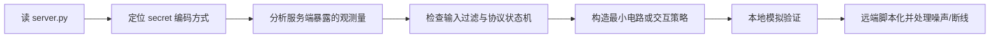
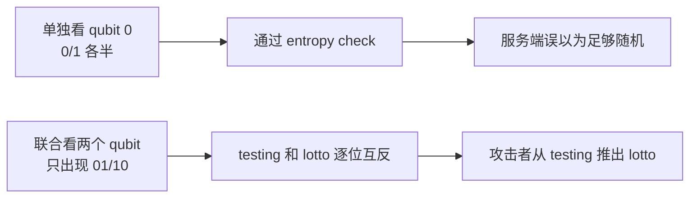
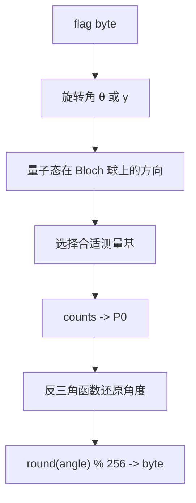
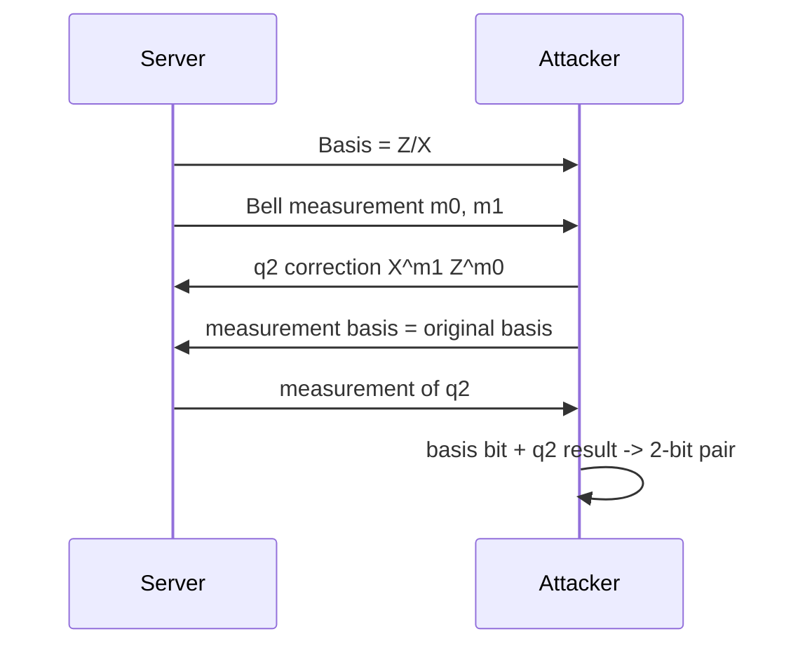
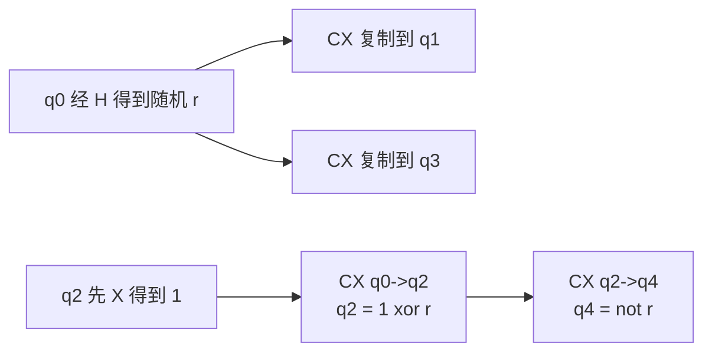
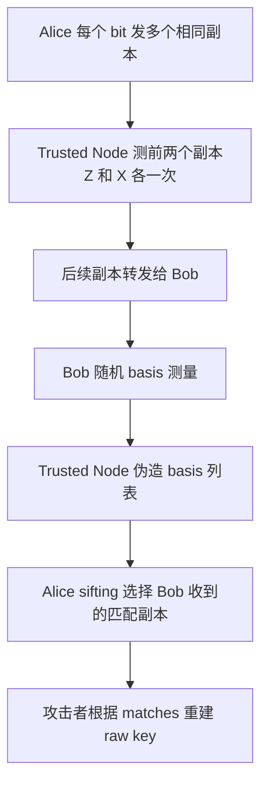

# Quantum CTF 实战总结：从 HTB Quantum 类题目学习量子攻防

这篇文档把作者 HTB 仓库 `ShundaZhang/htb` 中 `ctf/Quantum/` 分类里的题目整理成学习笔记，目标不是公开 flag 或复制完整一键脚本，而是把题目背后的量子计算概念、协议漏洞、实现细节和解题方法抽象出来，方便读者把前面学到的量子门、测量、纠缠、BB84、隐形传态、噪声模拟真正用到 CTF 场景里。

涉及题目：

| 题目 | 核心概念 | 主要考点 |
| --- | --- | --- |
| Quantum QLotto | Bell 态、边缘分布、Qiskit 索引 | 用负索引绕过参数过滤，构造反相关测量结果 |
| Quantum Phase Madness | Bloch 球、旋转门、测量基变换 | 从大量 counts 反推出编码在旋转角中的字节 |
| Quantum Flagportation | 量子隐形传态、Pauli 纠正 | 根据 Bell 测量结果恢复被传态的 2-bit 编码 |
| Quantum Noisy Vault | 噪声模型、统计恢复、bitstring 顺序 | 用结构上合规但物理上近似无害的电路通过校验，再多数投票 |
| Quantum Global Hyperlink Zone | 纠缠/相关态构造、share 约束 | 构造两组稳定相关且互反的测量序列 |
| Quantum Untrusted Node | BB84、basis sifting、中间人 | 利用多副本冗余和可伪造 sifting 窃取共享密钥 |

如果你遇到缩略语或基础概念，可以先查 [常用词汇表](glossary_zh.md)，尤其是 [Qubit](glossary_zh.md#qubit)、[Basis](glossary_zh.md#basis)、[Counts](glossary_zh.md#counts)、[Bell 态](glossary_zh.md#bell-state)、[BB84](glossary_zh.md#bb84)、[QKD](glossary_zh.md#qkd)、[CTF](glossary_zh.md#ctf)、[Pauli 纠正](glossary_zh.md#pauli-correction)。

## 1. Quantum CTF 到底在考什么

Quantum CTF 通常不会要求你发明新的量子算法。它更像“量子电路 + 安全工程 + 代码审计”的混合题。

常见题型包括：

| 题型 | 常见表现 | 解题关键词 |
| --- | --- | --- |
| 量子态恢复 | flag 被编码进旋转角、相位、测量基或 bitstring | 期望值、基变换、统计估计 |
| 协议攻击 | BB84、隐形传态、超密编码被改成交互协议 | 公开信息、纠正门、sifting、认证缺失 |
| 电路构造 | 服务端要求测量结果满足某种关系 | 纠缠态、相关态、CNOT 复制 classical correlation |
| 过滤绕过 | 服务端限制某些 qubit 或门，但参数检查不完整 | 负索引、bit order、transpile 后结构 |
| 噪声处理 | 返回 noisy counts，需要恢复隐藏 bitstring | 多数投票、最大似然、readout 误差 |
| 量子外衣下的经典漏洞 | 看似量子，实则 secret 是经典状态 | 找到真正的信息流和校验条件 |

Quantum CTF 的第一原则是：

```text
不要先被题面里的“量子感”带着跑；
先问：秘密到底被编码在哪里？我能观测什么？校验器真正检查什么？
```

## 2. 通用解题流程

建议按这个顺序审题：

1. **找编码位置**：flag/secret 是被放进 `X` 门、旋转角、相位、测量基，还是协议 transcript？
2. **找可观测量**：服务端返回单次测量、counts、memory、basis、Bell 测量结果，还是只返回通过/失败？
3. **找随机性来源**：随机来自量子测量、经典 RNG、shots 采样，还是噪声模型？
4. **找检查器边界**：参数过滤是否检查负数？是否只看边缘分布？是否只检查结构，不检查语义？
5. **找 bit order**：Qiskit counts/memory 的字符串顺序是否和 qubit 编号相反？
6. **先本地复现**：把服务端核心电路复制出来，用小 shots 和 statevector/counts 验证假设。
7. **把攻击变成稳定统计**：如果有噪声，优先考虑多数投票、重复采样、置信区间。

可以用一个总图表示：



## 3. 题目一：Quantum QLotto

### 3.1 题目模型

服务端创建 2-qubit 电路：

```text
初始：|00⟩
固定操作：H(0)
用户输入：若干量子门指令
检查：只测 qubit 0，要求 0/1 接近均匀
正式运行：measure_all，取 36 次 memory，拼成 6 个 lotto number 和 6 个 testing number
```

关键函数把每 6 次测量拼成两个 6-bit 数：

```text
testing_bits 来自每次 memory 的第一个字符
lotto_bits   来自每次 memory 的第二个字符
number = int(bits, 2) % 42 + 1
```

服务端会打印 `testing_numbers`，要求你猜中隐藏的 `lotto_numbers`。

### 3.2 漏洞一：负索引绕过 qubit 0 保护

服务端禁止参数等于 `0`，意图是不让你碰 qubit 0：

```text
if any(p == 0 for p in params): reject
```

但 Python/Qiskit 接受负索引：

```text
-1 -> 最后一个 qubit，也就是 qubit 1
-2 -> 倒数第二个 qubit，也就是 qubit 0
```

所以 `S:-2` 实际可以作用在 qubit 0 上，而不会触发 `p == 0`。

这是一个典型 CTF 点：题目看似限制量子操作，真正漏洞在输入校验。

### 3.3 漏洞二：只检查边缘分布，不检查联合分布

服务端的 entropy check 只测 qubit 0 是否接近 50/50。它没有检查 qubit 0 和 qubit 1 之间是否有相关性。

这就给了我们空间：构造一个反相关 Bell 类状态，让每个单独 qubit 看起来随机，但两个 qubit 的测量结果总是相反。

目标测量分布：

```text
P(01) = 1/2
P(10) = 1/2
P(00) = P(11) = 0
```

也就是：

```text
lotto_bit = 1 - testing_bit
```

示意图：



### 3.4 从 testing number 推 lotto number

每组 6 bit 中，如果 `testing_bits` 对应整数 `t`，那么 `lotto_bits` 是按位取反：

```text
lotto_int = 63 - t
T = t % 42 + 1
L = (63 - t) % 42 + 1
```

整理后得到确定映射：

```python
def lotto_from_testing(T: int) -> int:
    if 1 <= T <= 22:
        return 23 - T
    return 65 - T
```

### 3.5 这题学到什么

- **边缘随机不代表联合安全**：单独看每个 qubit 是 50/50，不代表两个 qubit 没有可利用相关性。
- **量子题也要做普通输入审计**：负索引、参数范围、类型转换仍然是漏洞入口。
- **Qiskit bit order 必须小心**：memory 字符串里的字符顺序和 qubit/classical bit 的映射要按代码确认。

## 4. 题目二：Quantum Phase Madness

### 4.1 题目模型

服务端把 flag 的每个字节当作一个角度，以 3 个字节为一组编码到独立 qubit：

```text
i % 3 == 0: RX(byte_i)
i % 3 == 1: RY(byte_i)
i % 3 == 2: H; RZ(byte_i)
```

交互时你可以指定：

```text
要测哪个 qubit
测量前追加哪些旋转门
```

服务端返回 `shots = 100000` 的 counts。也就是说，它给了非常高精度的概率估计。

### 4.2 RX/RY：从 Z 测量概率反推角度

初态是 `|0⟩`。经过 `RX(θ)` 或 `RY(θ)` 后，在 Z 基测得 `0` 的概率满足：

```text
P0 = (1 + cos θ) / 2
cos θ = 2P0 - 1
θ = arccos(2P0 - 1)
```

所以对 `i % 3 == 0/1` 的 qubit，只需要原始 Z 基测量一次，就能反推角度，再四舍五入还原字节。

### 4.3 H;RZ：相位藏在赤道面，Z 测不到

`H;RZ(γ)` 后，状态大致在 Bloch 球赤道上：

```text
X 分量 = cos γ
Y 分量 = sin γ
Z 分量 = 0
```

直接测 Z 基会接近 50/50，拿不到 `γ`。需要先做基变换：

| 追加操作 | 得到的量 | 公式 |
| --- | --- | --- |
| `RY:-90` | X 分量 | `cos γ = 2P0 - 1` |
| `RX:90` | Y 分量 | `sin γ = 2P0 - 1` |

然后：

```text
γ = atan2(sin γ, cos γ)
```

示意图：



### 4.4 这题学到什么

- **相位不是总能直接测出来**：Z 测量只看 Z 轴投影；相位常常要通过 X/Y 基变换读出。
- **大 shots 是侧信道**：100000 次采样让概率估计非常稳定，足够恢复整数角度。
- **不要过度测量**：RX/RY 只需一次原始测量；额外测量反而可能引入噪声和复杂性。

## 5. 题目三：Quantum Flagportation

### 5.1 题目模型

题目把每 2 个 classical bits 编成一个 qubit 态：

| bit pair | 量子态 | 正确测量基 |
| --- | --- | --- |
| `00` | `|0⟩` | Z |
| `01` | `|1⟩` | Z |
| `10` | `|+⟩` | X |
| `11` | `|-⟩` | X |

第一位决定测量基：

```text
Z -> 0
X -> 1
```

第二位是该基下的测量结果。

之后服务端执行标准量子隐形传态流程：

1. q1 和 q2 制备 Bell pair。
2. q0 是待传态的输入态。
3. 对 q0/q1 做 Bell 测量前置电路。
4. 服务端测量 q0 和 q1，打印 `m0, m1`。
5. 用户需要对 q2 施加纠正门，再选择测量基。

### 5.2 Pauli 纠正

量子隐形传态中，Bob 端 q2 需要根据 Alice 的两个 classical bits 做纠正：

```text
q2 <- X^m1 Z^m0 q2
```

也就是：

| `m0` | `m1` | 对 q2 的纠正 |
| --- | --- | --- |
| 0 | 0 | 不需要，或提交等效恒等门 |
| 1 | 0 | `Z` |
| 0 | 1 | `X` |
| 1 | 1 | `Z` 和 `X` |

题目还会打印原始 basis。纠正后在原始 basis 测 q2，就能得到第二位。

### 5.3 还原 bit pair

```text
first_bit  = 0 if basis == Z else 1
second_bit = corrected q2 的测量结果
pair       = first_bit || second_bit
```

把所有 pair 拼起来，每 8 bit 转字节即可。



### 5.4 这题学到什么

- **隐形传态不是“自动完成”**：没有 classical bits 和 Pauli 纠正，Bob 端状态是不完整的。
- **全局相位不影响测量**：`X` 和 `Z` 的顺序可能差一个全局相位，最终测量结果不变。
- **协议打印过多信息会直接破坏隐藏性**：basis 和 Bell 测量结果都给了，剩下只是按公式纠正。

## 6. 题目四：Quantum Noisy Vault

### 6.1 题目模型

服务端生成 64-bit secret，然后直接编码成计算基态：

```text
secret[i] == 1 -> X(data_qubit_i)
secret[i] == 0 -> 不操作
```

它允许你提交一个“纠错电路”，但只允许 oracle 查询一次。服务端会：

1. 检查电路结构是否有足够 data-ancilla links。
2. 检查是否激活足够多 ancilla。
3. 加入噪声模型和 idle cycles。
4. 测量 64 个 data qubits。
5. 返回 4096 shots 的完整 counts。

### 6.2 真正漏洞：结构检查不等于语义检查

服务端要求你“看起来”使用了 ancilla，但没有检查你是否真的做了纠错。

如果 ancilla 初始在 `|0⟩`，对 data 和 ancilla 做一些 `CZ(data, ancilla)`，在理想计算基态下不会改变 data 的最终测量值，却能被计为 data-ancilla link。

于是策略变成：

```text
用最小 CZ 结构满足 validator；
尽量少扰动 data；
从 noisy counts 中按位多数投票恢复 secret。
```

### 6.3 多数投票恢复

4096 shots 足够抵抗小概率 depolarizing/readout 噪声。对每一位统计 0/1 次数：

```text
bit_i = majority(counts over all returned bitstrings at position i)
```

关键坑是 Qiskit bitstring 顺序：

```text
counts 字符串通常显示为 c63 ... c0
secret_key 比较顺序是 qubit0 ... qubit63
```

所以投票得到的字符串可能需要整体反转后再提交。

### 6.4 这题学到什么

- **量子噪声不一定需要复杂纠错**：如果隐藏值本质是经典 bitstring，大量 noisy readout + 多数投票就够。
- **validator 只检查形式时，可以构造“合规但无害”的电路**。
- **bit order 是实战高频坑**：尤其是 Qiskit `counts`、`memory`、classical register 显示顺序。

## 7. 题目五：Quantum Global Hyperlink Zone

### 7.1 题目模型

服务端接受 5-qubit 电路指令，运行 256 shots，然后把每次测得的 5-bit 结果拆成 5 个 share：

```text
shares[i] = 第 i 个 qubit 在 256 次测量中的结果序列
```

通过条件是：

```text
shares[0] == shares[1] == shares[3]
shares[2] == shares[4]
shares[4] != shares[0]
并且每个 share 不能全 0 或全 1
```

直观上，需要构造：

```text
q0 = q1 = q3 = r
q2 = q4 = not r
```

其中 `r` 是每次 shot 里的随机 bit。

### 7.2 构造方法

使用 `H` 制造随机 bit，再用 CNOT 扩散 classical correlation：

```text
H:0
CX:0,1
CX:0,3
X:2
CX:0,2
CX:2,4
```

效果：



这不一定需要复杂纠缠解释。测量结果看起来可以理解为：每次 shot 先产生一个随机 `r`，再让其他 qubit 与它保持确定关系。

### 7.3 这题学到什么

- **题目要的是跨 shot 的 share 关系，不是单个 bit 的固定值**。
- **随机但相关比“全 0/全 1”更有用**：全 0/全 1 会被拒绝，随机相关序列反而通过。
- **CNOT 可以把计算基上的随机测量结果变成稳定相关结构**。

## 8. 题目六：Quantum Untrusted Node

### 8.1 题目模型

这是一个简化版 BB84/QKD 协议：

1. Alice 为每个 key bit 选择 bit 和 basis。
2. 每个 key bit 不是只发 1 个 qubit，而是发 `k = Poisson(λ=2)+2` 个相同副本。
3. Bob 随机选择 basis 测量收到的 qubit。
4. Alice 根据 Bob 上报的 basis 做 sifting，只保留第一个匹配位置。
5. 双方把 raw key 做 `sha256` 得到会话密钥。
6. 会话密钥用于 XOR 加密命令。

攻击者控制所谓 Trusted Node，可以：

- 选择性测量或丢弃传输中的 qubit。
- 看到 Bob 的真实 receiver gates。
- 伪造 Bob 汇报给 Alice 的 basis 列表。

### 8.2 核心漏洞：多副本破坏 BB84 安全直觉

BB84 的安全性依赖一个事实：未知量子态不能被完美复制，窃听者选错 basis 会引入扰动。

但这题 Alice 主动为每个 bit 发了多个相同副本。攻击者可以对同一个 chunk 的不同副本分别用 Z/X basis 测量：

```text
第 1 个副本：用 Z 测
第 2 个副本：用 X 测
后续副本：转发给 Bob
```

这样攻击者同时获得该 bit 在两种 basis 下的候选结果。

### 8.3 伪造 sifting

攻击者还能伪造 Bob 上报给 Alice 的 basis。策略是：

1. 对自己测过的前两个副本填无效 basis，让 Alice 不选择它们。
2. 对 Bob 真正收到的副本，复制 Bob 的真实 basis。
3. Alice 会在后续副本中选第一个 basis 匹配的位置。
4. 攻击者根据 Alice 返回的 matches 知道她最终保留了哪个位置。
5. 攻击者从自己提前测得的 Z/X 结果中取出对应 bit，重建 raw key。



### 8.4 这题学到什么

- **BB84 不能随意发送同一未知态的多个副本**：多副本给了攻击者分别测不同 basis 的机会。
- **QKD 还需要认证经典信道**：如果 basis 公告可以被中间人伪造，协议会直接失效。
- **协议安全不是量子性质自动保证的**：实现中的消息认证、状态机、错误率检测同样关键。

## 9. 横向总结：这些题共同考的能力

### 9.1 区分边缘分布和联合分布

QLotto 中，单看 qubit 0 是随机的，但两个 qubit 联合结果是完全可预测关系。

```text
边缘分布安全感：P(q0=0)=P(q0=1)=1/2
联合分布泄露：q1 = 1 - q0
```

这类错误在安全协议中很常见：只检查局部统计，没检查关联结构。

### 9.2 把测量基当作“读出接口”

Phase Madness 和 Flagportation 都在提醒一件事：

```text
你能读出什么，不只取决于量子态，还取决于你选择的测量基。
```

Z 基读不出 RZ 相位，X/Y 基可以；传态后的 q2 必须在原编码 basis 下测量才能还原 bit。

### 9.3 看清楚 secret 是量子还是经典

Noisy Vault 的 secret 本质上是经典 bitstring，只是被放进量子电路测量。遇到这种题，统计恢复往往比复杂量子算法更有效。

判断方法：

| 代码特征 | 说明 |
| --- | --- |
| `if bit == "1": circuit.x(i)` | secret 直接在计算基态 |
| 返回大量 `counts` | 可以做统计恢复 |
| 没有相位/叠加编码 | 不需要 QPE/Grover 这类重工具 |

### 9.4 不要忽略普通代码漏洞

Quantum CTF 里仍然有普通安全漏洞：

- 参数过滤不完整。
- 负索引绕过。
- 空输入处理异常。
- 只检查 transpile 后结构，不检查语义。
- 交互状态机允许伪造关键字段。

量子知识帮你理解物理效果，代码审计帮你找到入口。

### 9.5 Qiskit bit order 是必修课

很多题最后都卡在 bit order：

```text
qubit index order: q0, q1, q2, ...
counts display:    cN ... c1 c0
```

建议每题都用一个小电路验证：

```python
qc = QuantumCircuit(2, 2)
qc.x(0)
qc.measure([0, 1], [0, 1])
```

看 counts 是 `01` 还是 `10`，再决定是否反转。

## 10. Quantum CTF 速查表

| 看到的线索 | 优先想到 |
| --- | --- |
| `shots` 很大，返回 counts | 概率估计、期望值、统计恢复 |
| `RX/RY/RZ(angle)` 编码 secret | Bloch 球、反三角函数、基变换 |
| 打印 Bell measurement | 量子隐形传态 Pauli 纠正 |
| BB84/QKD + 可控中间节点 | basis sifting、经典信道认证、多副本问题 |
| 只检查 qubit 0 entropy | 构造纠缠/相关态，让边缘随机但联合可预测 |
| validator 检查 data-ancilla links | 找结构合规但语义无害的门 |
| 输出 bitstring 和提交 secret 不一致 | 检查 Qiskit endian/bit order |
| 禁止 `0` 但允许整数参数 | 测试负索引、越界、重复参数 |

## 11. 练习题

1. 为什么 QLotto 中 qubit 0 单独满足 50/50，仍然能泄露 lotto number？
2. 如果一个态的相位只体现在 X/Y 平面，为什么直接 Z 测量通常读不到相位？
3. 在隐形传态里，为什么 Bob 必须根据 `m0,m1` 做 `X/Z` 纠正？
4. Noisy Vault 中为什么多数投票可以替代复杂纠错？
5. Global Hyperlink Zone 中为什么不能简单让所有 share 都是全 0？
6. Untrusted Node 为什么违反了 BB84 的安全直觉？
7. 量子题里的 `counts` 和 `memory` 有什么区别？
8. 为什么 CTF 题里要特别注意 `transpile` 后的电路？

## 12. 参考答案

1. 因为服务端只检查 qubit 0 的边缘分布，没有检查 qubit 0 和 qubit 1 的联合分布。攻击者可以构造 `01/10` 反相关态，让 qubit 0 单独随机，但 qubit 1 总是它的取反。
2. Z 测量只读出 Bloch 球 Z 轴投影；RZ 相位通常表现为 X/Y 平面方向变化。要读相位，需要先用 `RX/RY/H` 等门把 X/Y 分量旋到 Z 轴再测。
3. Bell 测量会把待传态信息转移到 Bob 的 qubit 上，但会附带一个由 `m0,m1` 决定的 Pauli 误差。只有执行 `X^m1 Z^m0` 后，Bob 才得到原态。
4. 因为 secret 是经典 bitstring，噪声只是让每次 readout 有小概率翻转。4096 次采样下，每一位做多数投票就能以极高概率恢复真实值。
5. 服务端明确拒绝全 0 或全 1 的 share。需要让 share 随机但保持跨 qubit 的相等/不等关系。
6. Alice 为每个 bit 发送多个相同副本，攻击者可以用不同 basis 分别测副本；同时经典 sifting 信息可被伪造，导致攻击者能无错误重建 raw key。
7. `counts` 是每个 bitstring 出现次数的汇总；`memory` 是每一次 shot 的原始测量结果列表。需要拼接跨 shot 信息时常用 `memory`。
8. 因为服务端可能按 transpile 后的门统计结构、basis gates 或连接关系。原始输入看似通过，但优化后可能被消掉；反过来，也可以利用 validator 只看结构的弱点。

## 13. 后续学习建议

读完这篇后，建议回到本仓库对应主题：

1. 用 [BB84 文档](bb84_protocol_zh.md) 对照 Untrusted Node，理解正常 QKD 为什么需要抽样误码率检测和经典信道认证。
2. 用 [量子隐形传态示例](../examples/04_teleportation.py) 对照 Flagportation，把 `m0,m1` 到 `X/Z` 纠正的关系跑一遍。
3. 用 [Bell 态示例](../examples/02_bell_entanglement.py) 对照 QLotto，观察“单独随机、联合相关”的本质。
4. 用 [Qiskit 学习指南](learning_guide_zh.md) 补上 counts、shots、bit order、transpilation 的工程细节。
5. 用 [后量子密码文档](post_quantum_cryptography_zh.md) 区分 Quantum CTF、QKD、PQC、Shor/Grover 对密码系统的影响。
