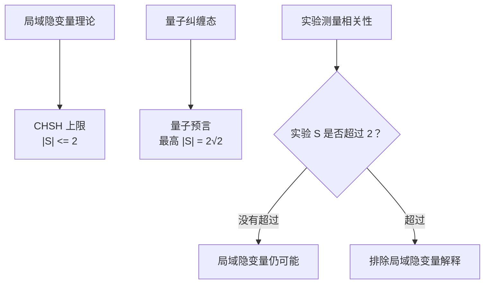
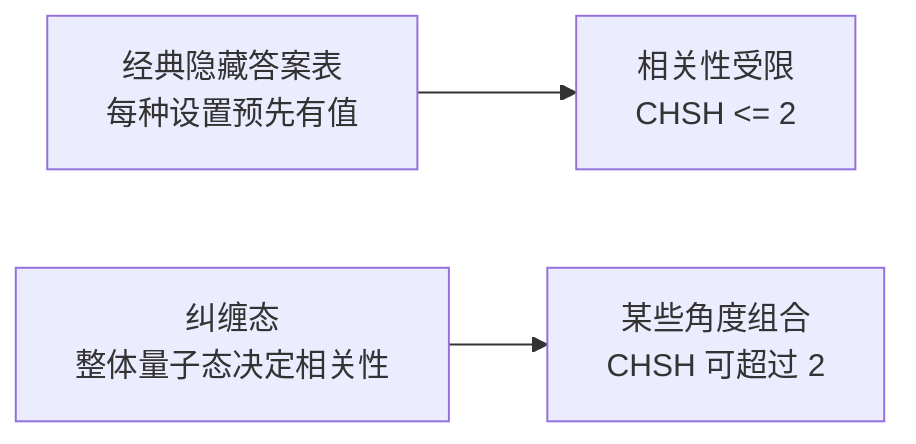
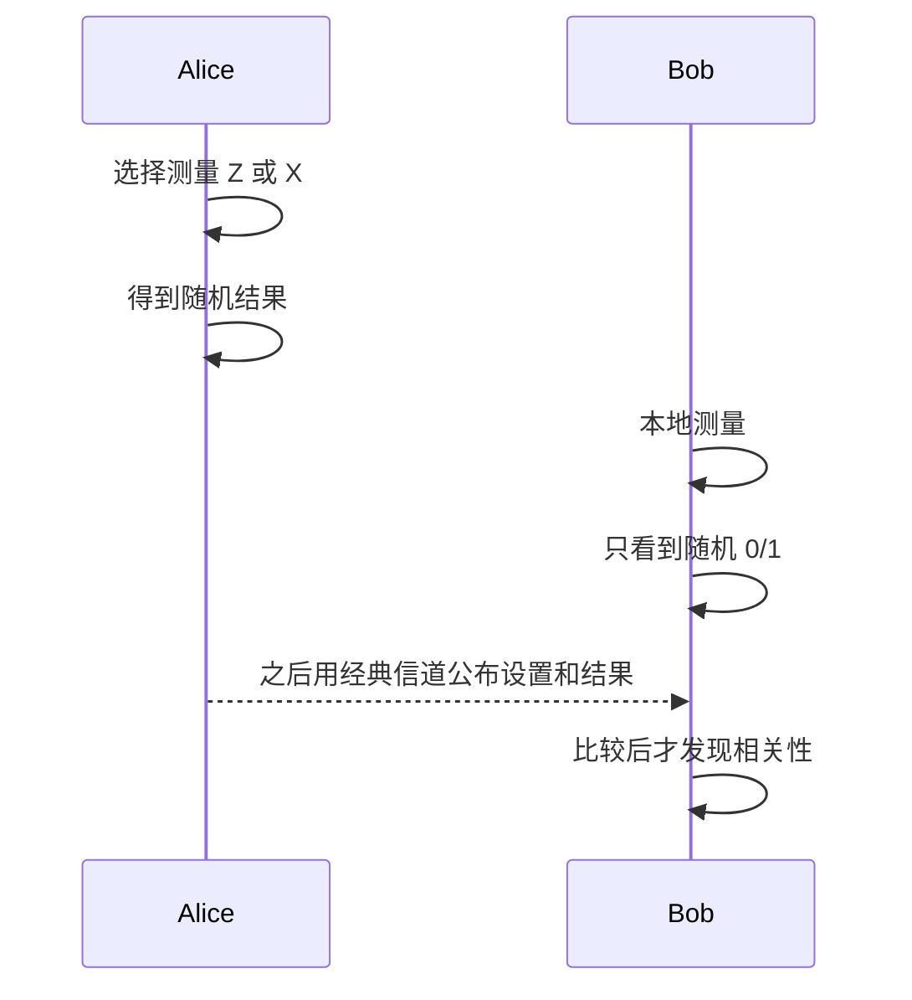
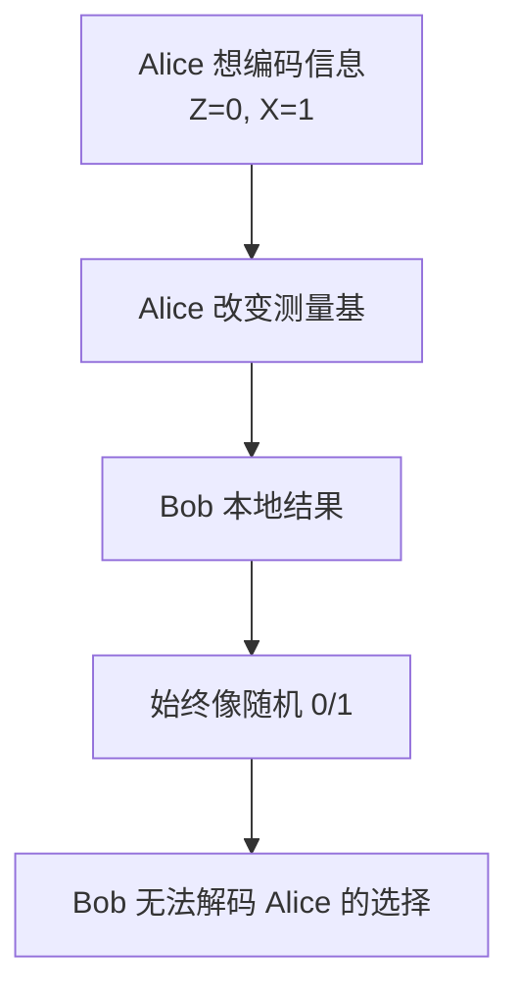
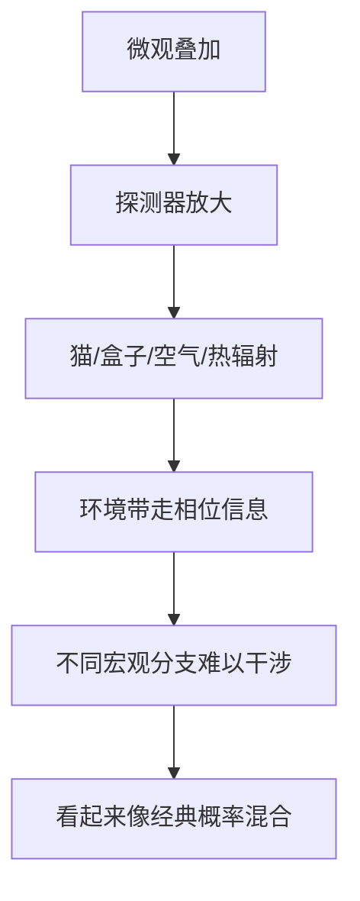
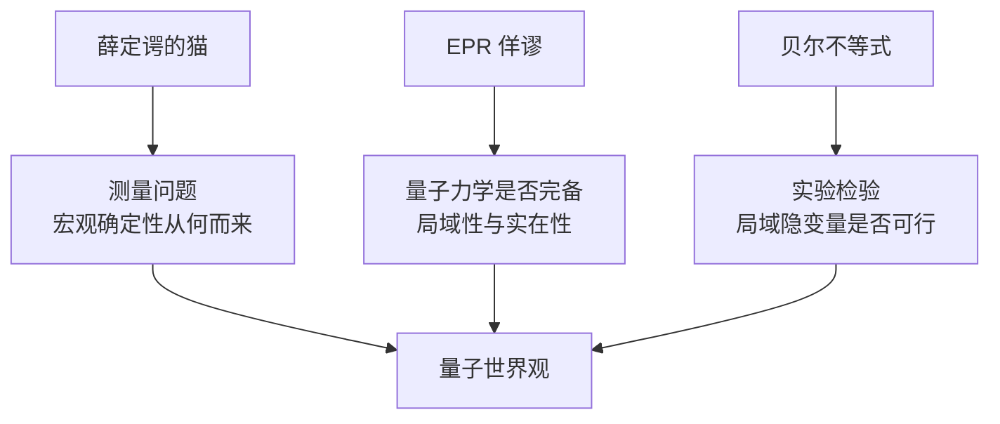
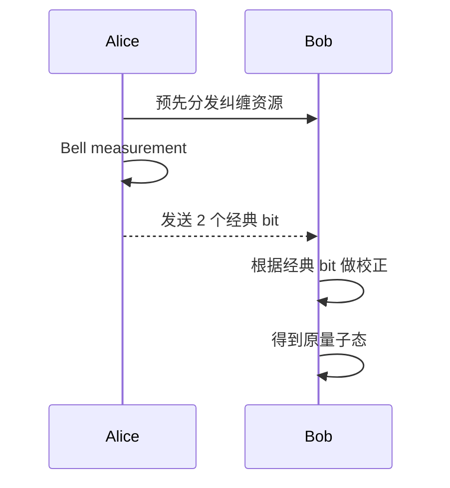

# 量子力学趣味专题：EPR、贝尔不等式、薛定谔的猫与超距关联

这篇文档不从代码开始，而从几个著名思想实验开始：EPR 佯谬、贝尔不等式、薛定谔的猫，以及“量子纠缠到底是不是超距作用、能不能超光速传递信息、会不会突破因果律”这些经常让人兴奋也经常让人误解的问题。

如果你遇到缩略语，可以先查 [常用词汇表](glossary_zh.md)，尤其是 [纠缠](glossary_zh.md#entanglement)、[Bell 态](glossary_zh.md#bell-state)、[EPR](glossary_zh.md#epr)、[贝尔不等式](glossary_zh.md#bell-inequality)、[无信号定理](glossary_zh.md#no-signaling)、[退相干](glossary_zh.md#decoherence)。

一句话先给结论：

```text
纠缠态能产生强到无法用局域隐变量解释的关联；
但单独一方的测量结果仍是随机的；
所以纠缠不能传递可控超光速信息，也不能用来突破因果律。
```

## 1. 为什么这些故事重要

量子力学的奇妙不只在“粒子很小”。

真正让人震撼的是：量子力学似乎挑战了我们对现实的几种直觉。

| 经典直觉 | 量子力学带来的冲击 |
| --- | --- |
| 物体总有确定属性，只是我们不知道 | 测量前某些属性可能不能被看成已有确定值 |
| 相距很远的系统应彼此独立 | 纠缠系统会出现非常强的远距离关联 |
| 测量只是被动读取 | 测量会参与定义结果 |
| 宏观世界不会叠加 | 薛定谔的猫逼问量子规则如何过渡到宏观 |

这些问题连接了三个层次：


## 2. EPR 佯谬：量子力学是不是不完备

EPR 来自 Einstein、Podolsky、Rosen 三人的姓氏。EPR 佯谬的核心不是“他们发现量子力学错了”，而是他们提出了一个非常尖锐的问题：

```text
如果量子力学允许远距离粒子出现强关联，
那它到底是在描述真实世界，
还是只是在描述我们对世界的不完整知识？
```

EPR 讨论的原始形式涉及位置和动量。今天入门时更常用自旋或 qubit 版本来讲。

设 Alice 和 Bob 共享一个纠缠态，例如：

```text
|Φ+⟩ = (|00⟩ + |11⟩) / √2
```

两个 qubit 被分开：


如果 Alice 测量自己的 qubit，得到 `0`，Bob 后续用同一基测量会得到 `0`；如果 Alice 得到 `1`，Bob 后续也会得到 `1`。

EPR 直觉会问：

1. Alice 测量时，Bob 的粒子是不是“立刻变了”？
2. 如果不是立刻变，那 Bob 的结果是不是早就藏好了？
3. 如果早就藏好了，量子态是不是只是我们不知道隐藏变量？
4. 如果不是藏好了，那量子力学是不是暗示某种超距影响？

这就是 EPR 佯谬的味道。

## 3. EPR 的两个核心假设

EPR 式论证通常包含两种经典直觉。

### 3.1 实在性

如果我们能在不扰动一个系统的情况下准确预言某个物理量，那么这个物理量应该对应某种真实存在的属性。

简单说：

```text
如果 Bob 的结果能被 Alice 远程预测，
那 Bob 的结果似乎应该在测量前就已经存在。
```

### 3.2 局域性

相隔很远、类空间隔的操作不应瞬间影响对方。

简单说：

```text
Alice 在这里选择测什么，
不应该立刻改变很远处 Bob 的真实物理状态。
```

EPR 认为，如果坚持这两点，那么量子力学对纠缠系统的描述可能不完备。也许底层还存在一些“隐藏变量”，提前决定了每次测量的结果。

## 4. 隐变量想法：是不是结果早就写好了

“隐藏变量”可以粗略理解成：

```text
粒子内部携带一张看不见的答案表；
我们以为测量随机，其实只是没看到答案表。
```

比如两个粒子出发前约定：

```text
如果测 Z 基：Alice 得 0, Bob 得 0
如果测 X 基：Alice 得 1, Bob 得 1
如果测其他方向：也有预先写好的答案
```

这听起来很合理，也很符合日常直觉。问题是：这样的局域隐藏答案表能否解释所有量子实验结果？

贝尔的伟大贡献就是把这个哲学问题变成可实验检验的不等式。

## 5. 贝尔不等式：把哲学问题变成实验问题

Bell 的想法很漂亮：

```text
如果世界由局域隐藏变量控制，
那么不同测量设置下的相关性必须满足某些上限。
量子力学预言某些纠缠态会超过这个上限。
实验可以判断谁对。
```

最常见的版本是 CHSH 不等式。

Alice 可以选择两种测量设置：

```text
A0 或 A1
```

Bob 可以选择两种测量设置：

```text
B0 或 B1
```

每次测量结果只有两种：

```text
+1 或 -1
```

定义相关性：

```text
E(Ai, Bj) = Alice 结果 * Bob 结果 的平均值
```

CHSH 组合是：

```text
S = E(A0, B0) + E(A0, B1) + E(A1, B0) - E(A1, B1)
```

如果存在局域隐变量模型，则必须满足：

```text
|S| <= 2
```

而量子力学对合适的纠缠态和测量方向预言：

```text
|S| <= 2√2
```

其中 `2√2 ≈ 2.828`，明显超过经典局域隐变量上限 `2`。



## 6. 直观理解贝尔不等式为什么会被违反

经典局域隐变量像一张预先写好的答案表。无论 Alice 和 Bob 后来选择什么设置，粒子内部已经为所有可能设置准备好了答案。

```text
隐藏答案表示例：
A0 -> +1
A1 -> -1
B0 -> +1
B1 -> +1
```

局域性要求 Alice 的结果只依赖 Alice 的设置和隐藏变量，不能依赖 Bob 远处临时选择了什么；Bob 同理。

这种“每个设置都有预先答案”的结构会限制四组相关性的组合，最后得到 `|S| <= 2`。

量子纠缠不是这样。纠缠态没有给每一个可能测量方向都预先写好确定答案。它给出的是一套整体相关性规则：

```text
同一方向测量：强相关或强反相关
不同方向测量：相关性随角度连续变化
```

这些相关性不能被同一张局域答案表同时解释。



## 7. 这是否说明有“超距作用”

答案要小心。

可以说：

```text
量子纠缠表现出非经典、非局域的关联。
```

但不应该直接说：

```text
Alice 发送了一个超光速信号给 Bob。
```

区别在这里：

| 问题 | 量子力学回答 |
| --- | --- |
| 纠缠关联能否违反局域隐变量模型？ | 能。Bell 实验支持这一点 |
| Alice 的测量选择能否控制 Bob 的单边结果？ | 不能。Bob 看到的仍是随机结果 |
| 纠缠能否发送可控信息？ | 不能 |
| 是否突破因果律？ | 标准量子理论中不会 |

这就是“非定域关联”和“超光速通信”的关键差别。

## 8. 无信号定理：为什么不能传递有效信息

仍用 Bell 态：

```text
|Φ+⟩ = (|00⟩ + |11⟩) / √2
```

Alice 和 Bob 分开很远。

如果 Alice 测量 Z 基，她会随机得到：

```text
0 或 1，各 50%
```

Bob 单独看自己的测量结果，也是：

```text
0 或 1，各 50%
```

如果 Alice 改测 X 基呢？Bob 单独看自己的结果，仍然是：

```text
0 或 1，各 50%
```

Bob 的本地统计不随 Alice 的选择改变。因此 Bob 无法仅凭自己手里的数据判断 Alice 测了什么、有没有测、想发 0 还是想发 1。



要发现纠缠关联，Alice 和 Bob 必须事后通过经典通信比较：

```text
测量设置
测量结果
时间标签
```

经典通信不能超过光速，所以这不会突破因果律。

## 9. 一个“不能发信息”的小实验想象

假设 Alice 想用纠缠给 Bob 超光速发一个 bit：

```text
Alice 想发 0：测 Z 基
Alice 想发 1：测 X 基
```

Bob 每次都测自己的粒子，记录结果：

```text
0, 1, 1, 0, 0, 1, ...
```

问题是：无论 Alice 测 Z 还是 X，Bob 看到的单边序列都像随机硬币。



只有 Alice 之后把自己的测量设置通过普通通信发给 Bob，Bob 才能把两边数据按设置分类，看到违反贝尔不等式的统计关联。

所以纠缠很神奇，但不是超光速电报机。

## 10. 纠缠与因果律

因果律通常要求：

```text
可控信息不能从未来影响过去；
可控信息不能超光速传播造成因果悖论。
```

纠缠不允许可控超光速信号，因此不会让你做出这样的操作：

```text
Alice 现在选择一个消息
Bob 在光信号到达前读出这个消息
Bob 根据消息改变过去会影响 Alice 的事件
```

量子理论保留了强非经典关联，同时又通过无信号结构保护了相对论因果性。


更准确地说：

```text
量子力学挑战的是“局域实在论”的朴素图像，
不是允许任意超光速通信的相对论因果结构。
```

## 11. 薛定谔的猫：宏观叠加的荒诞感

薛定谔的猫是另一个著名思想实验。

想象一个封闭盒子里有：

- 一只猫
- 一个放射性原子
- 一个探测器
- 一个毒气装置

规则是：

```text
如果原子衰变，探测器触发，毒气释放，猫死。
如果原子不衰变，猫活。
```

如果原子按量子力学处于“衰变 + 未衰变”的叠加，那么盒子整体似乎会变成：

```text
(|未衰变⟩|猫活⟩ + |已衰变⟩|猫死⟩) / √2
```


这个思想实验不是为了虐猫，而是为了问：

```text
如果微观世界能叠加，
为什么宏观世界看起来总有确定结果？
```

## 12. 猫到底是不是又死又活

要区分三件事：

### 12.1 数学态可以写成叠加

封闭系统如果严格按量子演化，确实可以写出类似“活猫 + 死猫”的叠加态。

### 12.2 现实宏观系统会强烈退相干

真实猫、盒子、空气分子、热辐射、探测器都和环境剧烈相互作用。宏观叠加的相干性会极快泄漏到环境中，这叫退相干。



退相干解释了为什么宏观世界看起来经典：不同宏观分支几乎不再发生可观测干涉。

### 12.3 测量问题仍有解释空间

退相干非常重要，但它不一定单独回答“为什么我只看到一个结果”。这涉及量子力学解释，例如：

| 解释方向 | 大致说法 |
| --- | --- |
| 哥本哈根式 | 测量时出现一个结果，量子态用于预测概率 |
| 多世界解释 | 所有分支都存在，观察者也分支 |
| 客观坍缩模型 | 量子态在某些条件下真实随机坍缩 |
| QBism/信息解释 | 量子态更像观察者对经验的概率赋值 |

这些解释在哲学图像上不同，但在通常实验预测上很接近。

## 13. EPR、Bell、猫之间的关系

这三个故事常被分开讲，其实它们在问同一个大问题：

```text
量子态到底是在描述真实世界本身，
还是描述我们对实验结果的预测规则？
测量结果为什么出现？
远距离关联到底意味着什么？
```



它们的分工可以这样理解：

| 主题 | 核心问题 |
| --- | --- |
| 薛定谔的猫 | 叠加为什么不在宏观世界直接显现 |
| EPR 佯谬 | 纠缠是否说明量子力学不完备 |
| 贝尔不等式 | 局域隐变量能否解释量子关联 |
| 无信号定理 | 纠缠为什么不能超光速通信 |

## 14. 量子隐形传态是否传递了超光速信息

量子隐形传态名字很容易误导。它传的是未知量子态，不是物体瞬移，也不是超光速通信。

隐形传态需要两种资源：

1. Alice 和 Bob 预先共享纠缠。
2. Alice 发送两个 classical bits 给 Bob。

没有第二步，Bob 无法完成正确校正。



因为经典 bit 不能超光速，所以隐形传态也不能超光速。

## 15. 超密编码是否突破信息上限

超密编码也容易被误解。

它的说法是：

```text
如果 Alice 和 Bob 已经共享一个 Bell pair，
Alice 发送 1 个 qubit 给 Bob，
Bob 可以解码 2 个 classical bits。
```

这看起来像“1 个 qubit 传 2 bit”，但前提是双方已经共享纠缠资源。纠缠资源的分发本身需要物理通信，不能超光速，也不是免费。

所以超密编码展示的是：

```text
纠缠资源 + 量子通信 可以提升通信协议能力；
但不能绕过因果律。
```

## 16. 常见误区

### 16.1 误区：纠缠就是两个粒子之间有一根看不见的线

更准确地说，纠缠是整体量子态不能分解成各子系统独立状态。它不是普通机械连接。

### 16.2 误区：Alice 测量会把 Bob 的粒子变成她想要的结果

Alice 不能控制自己的测量结果，因此也不能用它控制 Bob 的本地统计。

### 16.3 误区：贝尔实验证明一切都是随机的

贝尔实验主要排除的是一大类局域隐变量解释。它不等于一句话解决了所有量子解释问题。

### 16.4 误区：无信号定理说明纠缠没有实际用处

纠缠不能超光速通信，但非常有用。量子隐形传态、超密编码、量子密钥分发、量子计算中的纠缠资源都依赖它。

### 16.5 误区：薛定谔的猫说明量子力学荒谬所以错了

薛定谔的猫是在揭示测量问题的尖锐性，不是简单否定量子力学。量子力学的实验成功极其丰富，争论主要在解释层面。

## 17. 一个最小数学视角：为什么 Bob 单独看不到 Alice 的选择

Bell 态：

```text
|Φ+⟩ = (|00⟩ + |11⟩) / √2
```

Alice 和 Bob 的整体态是纯态，但 Bob 单独拥有的是一个混合态：

```text
ρ_B = 1/2 |0⟩⟨0| + 1/2 |1⟩⟨1|
```

这表示 Bob 本地看到的是完全随机的 0/1。

Alice 无论选择 Z 基测量还是 X 基测量，都不能改变 Bob 的本地密度矩阵。她只能改变“如果之后按某种方式分组比较，两边结果呈现什么相关性”。

这就是无信号定理的核心数学味道：

```text
远方操作可以改变整体关联的描述，
但不能改变本地可观测统计。
```

## 18. 和本仓库示例的连接

本仓库里有几个直接相关的例子：

| 示例 | 相关概念 |
| --- | --- |
| [examples/02_bell_entanglement.py](../examples/02_bell_entanglement.py) | Bell 态与纠缠 |
| [examples/03_superdense_coding.py](../examples/03_superdense_coding.py) | 共享纠缠增强通信 |
| [examples/04_teleportation.py](../examples/04_teleportation.py) | 隐形传态需要纠缠和经典通信 |
| [docs/bb84_protocol_zh.md](bb84_protocol_zh.md) | 测量扰动与窃听检测 |
| [docs/quantum_computing_intro_course_zh.md](quantum_computing_intro_course_zh.md) | Bell 态、纠缠和基础习题 |

建议你运行：

```bash
python examples/02_bell_entanglement.py
python examples/03_superdense_coding.py
python examples/04_teleportation.py
```

然后观察：

- Bell 示例中单独结果随机，但联合结果强相关。
- 超密编码需要预先共享 Bell pair。
- 隐形传态必须发送 classical bits 才能完成。

## 19. 小测试

1. EPR 佯谬主要质疑的是量子力学的哪一点？
2. 局域隐变量模型大致是什么意思？
3. CHSH 贝尔不等式的经典上限是多少？
4. 量子力学允许 CHSH 值最高达到多少？
5. 违反贝尔不等式说明能超光速通信吗？
6. 为什么 Bob 单独看自己的测量结果无法知道 Alice 选择了什么测量基？
7. 薛定谔的猫思想实验想说明什么问题？
8. 退相干能解释宏观世界为什么看起来经典吗？
9. 量子隐形传态为什么不是超光速传态？
10. 超密编码为什么不等于凭空用 1 个 qubit 传 2 bit？

## 20. 参考答案

1. 它质疑量子力学是否完备，以及量子纠缠是否与局域性、实在性冲突。
2. 粒子携带预先确定的隐藏变量，测量只是读取这些变量，而且远处选择不能瞬间影响本地结果。
3. `|S| <= 2`。
4. `2√2`。
5. 不说明。它说明量子关联不能由局域隐变量解释，但不能传递可控超光速信息。
6. 因为 Bob 的本地结果统计始终是随机的，不随 Alice 的测量选择改变。
7. 它把微观叠加推到宏观，逼问测量结果和经典世界从何而来。
8. 能解释许多宏观经典性的来源，尤其是为什么宏观叠加难以观察到干涉；但关于“为什么只看到一个结果”仍涉及量子解释。
9. 因为 Bob 必须收到 Alice 通过经典信道发送的 bits 才能完成校正。
10. 因为它依赖预先共享纠缠；纠缠分发和 qubit 发送都受物理通信限制。

## 21. 核心结论

1. **EPR 佯谬提出问题**：量子力学是否完备，远距离纠缠如何理解。
2. **贝尔不等式给出实验判据**：局域隐变量模型必须满足 `|S| <= 2`，量子纠缠可超过它。
3. **实验支持量子非经典关联**：纠缠关联不能被朴素局域隐藏答案表解释。
4. **纠缠不能超光速传递有效信息**：单边结果随机，必须事后经典通信比较才看到关联。
5. **因果律没有被突破**：标准量子理论保留无信号结构。
6. **薛定谔的猫聚焦测量问题**：它提醒我们解释微观叠加到宏观确定性的过渡并不简单。
