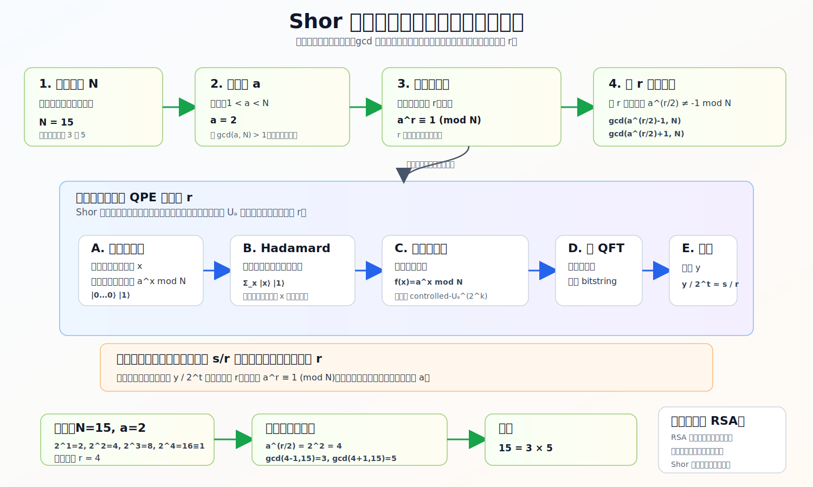

# Shor（肖尔/秀尔）算法技术详解

Shor 算法通常译作 **肖尔算法**。有些语境里也会写成“秀尔算法”，本文统一称为 **Shor 算法**。它是量子计算史上最著名的算法之一，因为它说明：如果有足够大、足够可靠的容错量子计算机，整数分解可以在多项式时间内完成，从而威胁以大整数分解困难性为基础的 RSA 等公钥密码体系。

配套图解：



## 1. Shor 算法解决什么问题

输入一个合数：

```text
N = p × q
```

目标是在不知道 `p` 和 `q` 的情况下，把 `N` 分解成非平凡因子。

例如：

```text
N = 15
```

输出：

```text
3 和 5
```

经典计算机当然可以分解小数，但对于几千 bit 的大整数，目前已知最好的通用经典算法仍然非常昂贵。RSA 的安全性正是建立在“大整数分解在经典计算上很难”这个事实之上。

Shor 算法的核心结论是：

```text
整数分解可以归约为周期寻找；
周期寻找可以用量子相位估计高效完成。
```

## 2. 总体结构：经典外壳 + 量子子程序

Shor 算法不是一个“全量子”流程。它是经典与量子混合的：

1. 经典随机选择一个数 `a`。
2. 经典计算 `gcd(a, N)`，如果已经得到因子就结束。
3. 量子子程序寻找 `a` 模 `N` 的阶，也就是周期 `r`。
4. 经典后处理用 `r` 恢复 `N` 的因子。

伪代码：

```text
输入 N
如果 N 是偶数，返回 2
随机选 a，满足 1 < a < N
d = gcd(a, N)
如果 d > 1，返回 d

用量子阶寻找子程序找到 r，使 a^r ≡ 1 (mod N)
如果 r 是奇数，重新选 a
如果 a^(r/2) ≡ -1 (mod N)，重新选 a

p = gcd(a^(r/2) - 1, N)
q = gcd(a^(r/2) + 1, N)
返回 p, q
```

## 3. 从分解到阶寻找

选择一个与 `N` 互素的整数 `a`。考虑下面这个序列：

```text
a^0 mod N, a^1 mod N, a^2 mod N, a^3 mod N, ...
```

因为模 `N` 的余数只有有限多个，这个序列会周期性重复。我们要找最小正整数 `r`，使得：

```text
a^r ≡ 1 (mod N)
```

这个 `r` 叫做 `a mod N` 的 **阶**，也就是模指数函数的周期。

为什么知道 `r` 就可能分解 `N`？

如果：

```text
a^r ≡ 1 (mod N)
```

那么：

```text
a^r - 1 ≡ 0 (mod N)
```

当 `r` 是偶数：

```text
a^r - 1 = (a^(r/2) - 1)(a^(r/2) + 1)
```

因此：

```text
N | (a^(r/2) - 1)(a^(r/2) + 1)
```

如果 `a^(r/2)` 不是 `-1 mod N`，那么 `N` 的非平凡因子通常可以从下面两个最大公约数中拿到：

```text
gcd(a^(r/2) - 1, N)
gcd(a^(r/2) + 1, N)
```

## 4. 小例子：分解 15

取：

```text
N = 15
a = 2
```

先检查：

```text
gcd(2, 15) = 1
```

没有直接得到因子。

接着看 `2^x mod 15`：

```text
x = 0: 2^0 mod 15 = 1
x = 1: 2^1 mod 15 = 2
x = 2: 2^2 mod 15 = 4
x = 3: 2^3 mod 15 = 8
x = 4: 2^4 mod 15 = 16 mod 15 = 1
```

所以周期：

```text
r = 4
```

因为 `r` 是偶数：

```text
a^(r/2) = 2^2 = 4
```

计算：

```text
gcd(4 - 1, 15) = gcd(3, 15) = 3
gcd(4 + 1, 15) = gcd(5, 15) = 5
```

得到：

```text
15 = 3 × 5
```

这个例子很小，经典计算一眼能看出答案；它的作用是展示 Shor 算法的结构。

## 5. 量子子程序到底做什么

量子部分不直接输出因子。它做的是：

```text
找到函数 f(x) = a^x mod N 的周期 r
```

为了做到这一点，Shor 算法使用一个可逆的模乘算子：

```text
U_a |y⟩ = |a y mod N⟩
```

如果反复作用：

```text
U_a^x |1⟩ = |a^x mod N⟩
```

周期 `r` 隐藏在这个算子的本征相位中。量子相位估计 QPE 可以估计这些相位，然后经典后处理从相位中恢复 `r`。

## 6. QPE 视角

如果一个酉算子满足：

```text
U |u⟩ = e^(2πiθ) |u⟩
```

那么 QPE 可以估计 `θ`。

在 Shor 算法中，`U_a` 的本征相位和周期 `r` 有关系，通常可以写成：

```text
θ = s / r
```

其中 `s` 是某个整数。

QPE 测量后不会直接给出 `r`，而是给出一个二进制数 `y`，满足：

```text
y / 2^t ≈ s / r
```

这里 `t` 是计数寄存器 qubit 数量。然后用连分数算法从 `y / 2^t` 中恢复分母 `r`。

## 7. 电路结构

Shor 算法的量子电路可以分成几个大块：

### 7.1 计数寄存器

计数寄存器用于相位估计。先把它初始化为：

```text
|0...0⟩
```

然后对每个 qubit 施加 Hadamard，得到均匀叠加：

```text
1/√Q Σ_x |x⟩
```

其中 `Q = 2^t`。

### 7.2 工作寄存器

工作寄存器初始化为：

```text
|1⟩
```

它会承载：

```text
|a^x mod N⟩
```

### 7.3 受控模指数运算

根据计数寄存器中的 `x`，在工作寄存器上计算：

```text
|x⟩|1⟩ -> |x⟩|a^x mod N⟩
```

真实电路不会直接“黑盒计算指数”，而是分解为很多可逆模乘、受控加法、Toffoli、CNOT、单 qubit 门等基础操作。

### 7.4 逆 QFT

模指数函数的周期信息通过相位结构编码在计数寄存器里。逆量子傅里叶变换把这种相位周期结构转换成测量时的尖峰分布。

测量后，你得到：

```text
y
```

它近似满足：

```text
y / 2^t ≈ s / r
```

### 7.5 经典连分数后处理

用 continued fractions，也就是连分数展开，把 `y / 2^t` 近似成一个分母不太大的分数：

```text
s / r
```

候选分母就是周期 `r`。然后验证：

```text
a^r mod N == 1
```

如果验证失败，重新采样或重新选择 `a`。

## 8. 为什么 QFT 能找周期

可以先用经典傅里叶变换类比。

如果一个信号有周期，傅里叶变换会在对应频率上出现峰值。Shor 算法中，模指数函数：

```text
f(x) = a^x mod N
```

对 `x` 呈周期性。量子电路把多个 `x` 的信息放入叠加态，并通过模指数运算把周期结构写入量子态。逆 QFT 会让测量结果集中在与周期 `r` 有关的位置。

直观地说：

```text
周期 r 越明确，QFT 后的测量峰值越集中在 s/r 对应的位置。
```

## 9. 和普通 QPE 的关系

在本仓库的入门示例里，QPE 估计的是一个简单 phase gate 的相位，比如：

```text
θ = 3/8
```

Shor 算法中，QPE 的对象更复杂：

```text
U_a |y⟩ = |a y mod N⟩
```

但核心模式一样：

```text
构造酉算子 U
让计数寄存器控制 U^(2^k)
执行逆 QFT
测量得到相位近似
用经典后处理恢复目标参数
```

Shor 的难点在于高效实现 `U_a`，也就是可逆模乘和模指数电路。

## 10. 技术细节：寄存器规模

假设 `N` 是一个 `n` bit 的整数。

工作寄存器需要能表示 `0` 到 `N-1`：

```text
n 个 qubit 左右
```

计数寄存器通常需要足够高精度来恢复 `r`，常见教学写法会取：

```text
t ≈ 2n
```

这样测量的 `y / 2^t` 有足够精度通过连分数恢复 `s/r`。

完整容错实现还需要大量辅助 qubit 和纠错开销，所以实际资源远远超过这个抽象寄存器数量。

## 11. 技术细节：可逆模指数

经典函数：

```text
f(x) = a^x mod N
```

看起来不可逆，因为很多 `x` 可能对应同一个余数。但在量子电路中我们不会把 `x` 擦掉，而是做可逆映射：

```text
|x⟩|1⟩ -> |x⟩|a^x mod N⟩
```

或者使用受控模乘：

```text
|y⟩ -> |a^(2^k) y mod N⟩
```

其中控制来自计数寄存器的第 `k` 个 qubit。

这个模块是 Shor 电路资源消耗的大头。真实编译时，它会被拆成：

- 可逆加法
- 可逆比较
- 模加法
- 模乘法
- Toffoli / CCX
- CNOT
- 单 qubit 旋转
- 可能还有大量辅助 qubit

## 12. 为什么需要连分数

QPE 的测量结果是整数 `y`，不是直接的分数 `s/r`。

如果计数寄存器大小是 `t`，那么：

```text
y / 2^t
```

是对某个 `s/r` 的近似。

例如如果：

```text
y / 2^t ≈ 0.25
```

那么连分数可能恢复：

```text
1/4
```

候选周期就是：

```text
r = 4
```

不过有时会测到 `s/r` 中 `s` 和 `r` 不互素，或者测量误差导致候选不正确，所以必须验证：

```text
a^r ≡ 1 (mod N)
```

## 13. 成功条件和失败重试

即使量子子程序正常运行，某次尝试也可能失败：

- 随机选到的 `a` 不合适。
- 找到的 `r` 是奇数。
- `a^(r/2) ≡ -1 (mod N)`。
- 连分数恢复出错误候选。
- 量子测量采样到了不利的 `s`。
- 噪声破坏了电路。

失败并不意味着算法错了；标准 Shor 算法本来就是概率算法。失败时重新选择 `a` 或重新运行量子子程序即可。

## 14. 复杂度直觉

Shor 算法在理想量子计算模型中可以用多项式时间分解整数。粗略说：

```text
经典最优通用分解算法：亚指数但非多项式
Shor 算法：多项式时间
```

这就是它对 RSA 重要的原因。

但这不等于今天的量子电脑已经能破解实际 RSA：

- 需要足够多的逻辑 qubit。
- 需要量子纠错。
- 需要极低逻辑错误率。
- 需要能执行非常长的容错电路。
- 物理 qubit 资源开销巨大。

因此：

```text
Shor 算法在理论上非常强；
工程上还需要大规模容错量子计算机。
```

## 15. 对密码学的影响

Shor 算法直接威胁：

- RSA
- Diffie-Hellman
- 椭圆曲线密码 ECC

原因是这些体系依赖：

- 整数分解困难
- 离散对数困难
- 椭圆曲线离散对数困难

Shor 算法不仅能用于整数分解，也能解决离散对数类问题。

因此现代密码迁移方向是：

```text
后量子密码 Post-Quantum Cryptography, PQC
```

PQC 是在经典计算机上运行、但希望抵抗已知量子攻击的密码算法，例如格密码、哈希签名、码基密码等。

## 16. Shor 算法不是什么

常见误区：

### 误区 1：Shor 能让所有问题指数加速

不是。Shor 针对的是具有特殊代数结构的问题，例如周期寻找、整数分解、离散对数。

### 误区 2：量子电脑直接并行试除所有因子

不是。Shor 并不是把所有候选因子同时试一遍，然后读出答案。它是把分解问题转成周期寻找，再用量子相位估计抽取周期。

### 误区 3：只要有几十个 qubit 就能破 RSA

不是。演示 `N=15`、`N=21` 的小电路和破解真实 RSA 完全不是一个量级。真实攻击需要容错逻辑 qubit 和大量物理 qubit。

## 17. 和本仓库示例的关系

本仓库已经有一个 QPE 示例：

```text
examples/07_phase_estimation.py
```

它估计简单相位：

```text
phase = 3 / 8
```

你可以把它看成 Shor 的一个最小子概念：

```text
QPE 能把酉算子的相位变成可读 bitstring。
```

Shor 算法只是在这个基础上，把酉算子换成更复杂的模乘算子：

```text
U_a |y⟩ = |a y mod N⟩
```

并通过经典数论后处理把相位分母变成周期 `r`，再从 `r` 中恢复因子。

## 18. 学习路线

建议按这个顺序学习 Shor：

1. 理解模运算和最大公约数 `gcd`。
2. 理解“阶”：

   ```text
   a^r ≡ 1 (mod N)
   ```

3. 用 `N=15, a=2` 手算周期 `r=4`。
4. 理解为什么 `r` 能通过 `gcd(a^(r/2) ± 1, N)` 给出因子。
5. 复习 QPE：`U|u⟩ = e^(2πiθ)|u⟩`。
6. 理解 `θ = s/r`，以及为什么要用连分数恢复 `r`。
7. 最后再看可逆模指数电路如何实现。

## 19. 课后习题

1. Shor 算法为什么会威胁 RSA？
2. Shor 算法中的量子子程序直接输出因子吗？
3. 什么是 `a mod N` 的阶？
4. 对 `N=15, a=2`，手算 `2^x mod 15` 的周期。
5. 如果找到 `r=4`，如何从 `a=2, N=15` 中恢复因子？
6. 为什么要求 `r` 是偶数？
7. 如果 `a^(r/2) ≡ -1 (mod N)`，为什么这次尝试失败？
8. QPE 在 Shor 算法中估计的相位大致是什么形式？
9. 为什么需要连分数算法？
10. Shor 算法和 Grover 算法的加速类型有什么不同？

## 20. 参考答案

1. RSA 依赖大整数分解困难；Shor 在容错量子计算机上可多项式时间分解整数。
2. 不直接输出因子。量子子程序主要找周期 `r`，因子由经典后处理恢复。
3. 最小正整数 `r`，使得 `a^r ≡ 1 (mod N)`。
4. `2^0=1`，`2^1=2`，`2^2=4`，`2^3=8`，`2^4=16≡1`，所以周期 `r=4`。
5. `a^(r/2)=2^2=4`，`gcd(4-1,15)=3`，`gcd(4+1,15)=5`。
6. 因为要把 `a^r-1` 分解成 `(a^(r/2)-1)(a^(r/2)+1)`。
7. 此时 `a^(r/2)+1` 是 `N` 的倍数，通常无法产生非平凡因子，只会得到无用结果。
8. 形式为 `s/r`，其中 `r` 是周期。
9. 因为测量得到的是 `y/2^t` 对 `s/r` 的近似，需要从近似小数恢复分母 `r`。
10. Grover 对无结构搜索给平方加速；Shor 利用代数周期结构，对分解和离散对数给多项式时间算法。
