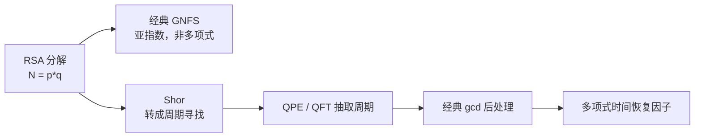
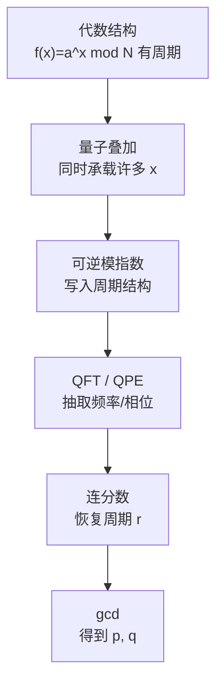
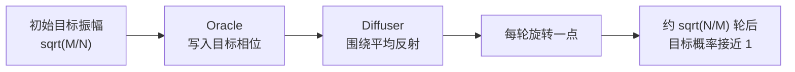
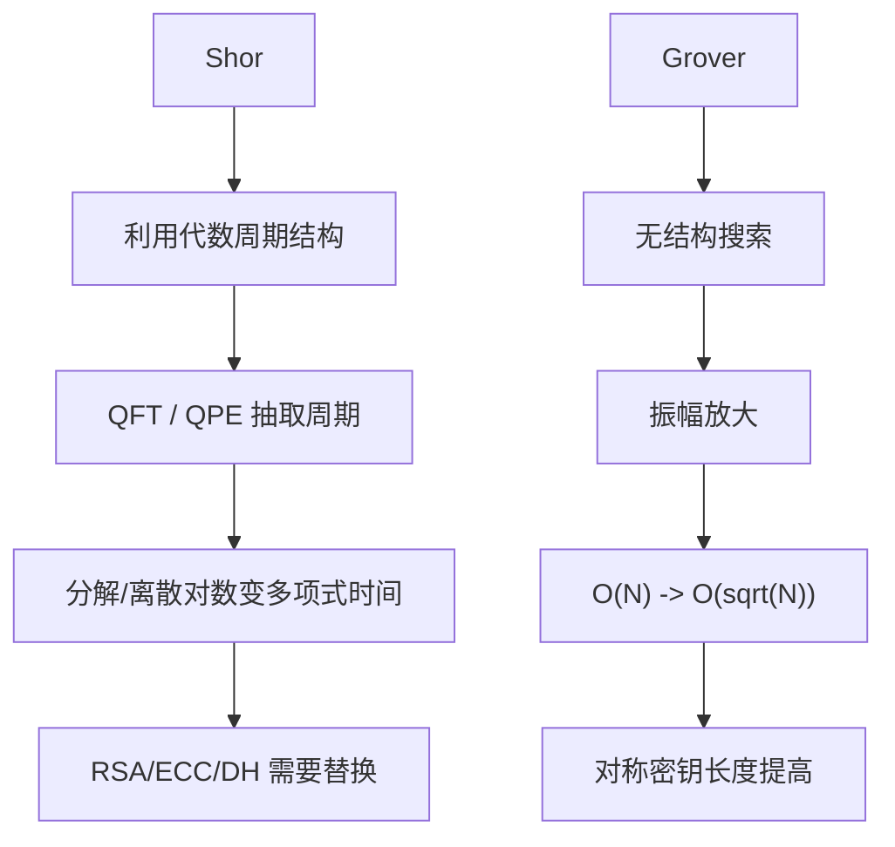

# Shor 与 Grover 的时间复杂度加速对比

Shor 和 Grover 都是量子计算里极有代表性的算法，但它们的“加速威力”完全不是同一种东西。

一句话先给结论：

```text
Shor：利用问题的代数周期结构，把整数分解/离散对数从经典困难问题降到量子多项式时间；
Grover：对无结构搜索给平方加速，把 O(N) 降到 O(√N)，或把 k-bit 暴力搜索从 O(2^k) 降到 O(2^(k/2))。
```

这也是为什么：

```text
RSA / DH / ECC 需要被后量子算法替换；
AES / SHA / HMAC 总体仍可用，但高安全场景要提高密钥长度或摘要长度。
```

## 1. 总览表

| 算法 | 解决的问题 | 经典复杂度直觉 | 量子复杂度直觉 | 加速性质 | 密码学威胁 |
| --- | --- | --- | --- | --- | --- |
| Shor | 整数分解、离散对数、椭圆曲线离散对数 | RSA 分解：最佳通用经典算法为亚指数但非多项式；ECC 离散对数：通用攻击约指数级 | 关于输入 bit 长度的多项式时间 | 结构性巨大加速；对相关公钥密码是“击穿式”威胁 | RSA、DH、ECDH、DSA、ECDSA、EdDSA 需要迁移 |
| Grover | 无结构搜索、暴力搜索、preimage search | `O(N)`，若搜索 k-bit key 则 `O(2^k)` | `O(√N)`，若搜索 k-bit key 则 `O(2^(k/2))` | 平方加速；不是指数级加速 | 对称密钥安全强度约减半，高价值场景倾向 AES-256 |

注意表里的“经典复杂度直觉”不是说所有经典算法都只能暴力搜索。Shor 针对的是有特殊代数结构的问题；Grover 针对的是没有结构可利用的黑盒搜索。

## 2. Shor 的加速到底是多少

### 2.1 对 RSA 整数分解

RSA 的安全性依赖：

```text
给定 N = p * q，已知 N，很难恢复 p 和 q。
```

如果 `N` 是一个 `n` bit 的大整数，经典最好的通用分解算法通常用 GNFS（General Number Field Sieve，通用数域筛）描述，其复杂度常写成亚指数形式：

```text
L_N[1/3, (64/9)^(1/3)]
≈ exp( c * (ln N)^(1/3) * (ln ln N)^(2/3) )
```

这里 `N` 是整数本身，不是候选数量。换成输入 bit 长度 `n = log2(N)` 来看，它不是 `poly(n)`，增长仍然非常快。

Shor 算法在理想容错量子计算模型中，可以用关于 `n` 的多项式时间完成整数分解。教学里常粗略写成：

```text
Shor factoring: poly(n)
```

很多基础资料会把主要量子门复杂度粗略说成 `O(n^3)` 量级；更先进实现会优化常数和幂次，但对入门读者最重要的结论是：

```text
经典：亚指数但非多项式
量子 Shor：多项式
```

这不是普通常数倍提速，而是复杂度类别上的巨大变化。



### 2.2 对 ECC / ECDH / ECDSA / EdDSA

ECC 的核心困难问题是椭圆曲线离散对数：

```text
已知 G 和 Q = xG，求秘密 x。
```

对设计良好的椭圆曲线，已知通用经典攻击通常是 Pollard rho，复杂度大约：

```text
O(√q)
```

如果曲线提供约 `k` bit 经典安全强度，攻击量级大约是：

```text
O(2^k)
```

例如 256-bit 椭圆曲线常说约提供 128-bit 经典安全强度，因为通用攻击约 `2^128`。

Shor 算法可以在多项式时间内解决离散对数，包括椭圆曲线离散对数。因此：

```text
经典 ECC 攻击：指数级量级
量子 Shor 攻击：多项式时间
```

这就是 ECC 在后量子时代需要迁移的根本原因。

## 3. Shor 为什么能做到这种加速

Shor 不是把所有可能因子同时试一遍。它的关键是：

```text
把整数分解或离散对数问题转化为周期寻找 / 相位估计问题。
```

以 RSA 分解为例：

1. 随机选一个 `a`。
2. 构造周期函数：

```text
f(x) = a^x mod N
```

3. 这个函数存在周期 `r`：

```text
a^r ≡ 1 mod N
```

4. 量子电路用叠加态和模指数运算把周期结构编码进相位。
5. QFT / QPE 把周期信息转换成可测结果。
6. 经典连分数和 `gcd` 后处理恢复因子。



所以 Shor 的加速来自 **隐藏周期结构 + 量子傅里叶采样**。这类结构在 RSA/DH/ECC 中正好存在。

## 4. Grover 的加速到底是多少

Grover 解决的是无结构搜索：

```text
N 个候选里有 M 个目标。
Oracle 能判断一个候选是不是目标。
```

经典黑盒搜索需要约：

```text
O(N / M)
```

次 oracle 查询。

Grover 需要约：

```text
O(sqrt(N / M))
```

次 oracle 查询。

如果是 k-bit 密钥暴力搜索：

```text
N = 2^k
M = 1
```

则：

```text
经典：O(2^k)
Grover：O(2^(k/2))
```

也就是安全强度粗略减半。

| 搜索对象 | 经典暴力搜索 | Grover 搜索 | 直觉 |
| --- | ---: | ---: | --- |
| 64-bit key | `2^64` | `2^32` | 明显削弱 |
| 128-bit key | `2^128` | `2^64` | 后量子高保证不足 |
| 256-bit key | `2^256` | `2^128` | 仍非常强 |

这就是为什么常说：

```text
后量子时代，对称密钥长度最好翻倍。
```

## 5. Grover 为什么只能平方加速

Grover 的核心是振幅放大。

初始均匀叠加中，目标子空间的总概率是：

```text
M / N
```

目标方向的振幅量级是：

```text
sqrt(M / N)
```

每一轮 Grover 迭代由两个反射组成：

1. Oracle：给目标态加负相位。
2. Diffuser：围绕平均振幅反射。

几何上看，每轮迭代把状态向目标方向旋转一个固定角度。初始角度大约是：

```text
θ ≈ sqrt(M / N)
```

要把状态旋转到接近目标方向，需要约：

```text
1 / θ ≈ sqrt(N / M)
```

轮。



这也是 Grover 的理论边界：在黑盒无结构搜索模型中，平方加速是最优的；不能期望 Grover 把 `O(N)` 变成 `poly(log N)`。

## 6. 为什么 Shor 对公钥密码是“替换级威胁”

RSA、DH、ECC 依赖的问题都有特殊代数结构：

| 密码算法 | 依赖的困难问题 | Shor 的影响 |
| --- | --- | --- |
| RSA | 大整数分解 | 多项式时间分解 `N`，恢复私钥 |
| DH / DSA | 有限域离散对数 | 多项式时间求离散对数 |
| ECDH / ECDSA / EdDSA | 椭圆曲线离散对数 | 多项式时间求私钥标量 |

这意味着仅仅把 RSA key 从 2048 bit 增加到 4096 bit 不是长期解决方案。它会增加攻击资源，但没有改变问题结构；一旦有足够大的容错量子计算机，Shor 仍然适用。

所以后量子迁移中，公钥部分需要换成不依赖分解/离散对数的新算法，例如：

- ML-KEM / HQC 等 KEM，用于替代密钥交换。
- ML-DSA / SLH-DSA / FN-DSA 等签名，用于替代 RSA/ECDSA/EdDSA 签名。

## 7. 为什么 Grover 对对称密码是“加固级威胁”

AES、HMAC、SHA-2/SHA-3 不依赖分解或离散对数。Grover 能做的是加速暴力搜索或 preimage search。

| 对象 | 经典安全强度 | Grover 直觉下 | 迁移建议 |
| --- | ---: | ---: | --- |
| AES-128 | 128 bit | 约 64 bit | 普通场景仍广泛使用；高价值长期保密偏向 AES-256 |
| AES-256 | 256 bit | 约 128 bit | 后量子高保证常用选择 |
| SHA-256 preimage | 256 bit | 约 128 bit | 仍强 |
| SHA-384 preimage | 384 bit | 约 192 bit | 高保证 |
| SHA-512 preimage | 512 bit | 约 256 bit | 高保证 |

因此 Grover 通常不要求“替换 AES 这个算法族”，而是要求：

```text
提高密钥长度 / 摘要长度 / 安全参数。
```

还要注意：真实 Grover 攻击需要把 AES 或哈希函数实现成可逆量子 oracle，成本很高；量子纠错、串行深度、并行化限制都会增加实际难度。因此这类威胁通常比 Shor 对 RSA/ECC 的结构性威胁更温和。

## 8. 关键差异：结构性加速 vs 黑盒平方加速



可以这样记：

```text
Shor 找结构，所以能把某些经典困难问题彻底改写；
Grover 没有结构，只能把搜索空间开平方。
```

## 9. 工程现实：复杂度不等于今天就能攻击

两类算法都需要足够强的量子硬件。

Shor 攻击现实 RSA/ECC 需要：

- 大量逻辑 qubit。
- 量子纠错。
- 长时间低错误率运行。
- 高效可逆模指数或椭圆曲线算术电路。

Grover 攻击现实 AES/SHA 需要：

- 把目标算法做成可逆量子 oracle。
- 大量串行 Grover 迭代。
- 长时间相干和纠错。
- 巨大门数资源。

所以：

```text
复杂度结果告诉我们长期迁移方向；
工程资源决定实际攻击何时可行。
```

## 10. 学习建议

建议把三篇文档连起来看：

1. [grover_algorithm_zh.md](grover_algorithm_zh.md)：理解平方加速和振幅放大。
2. [shor_algorithm_zh.md](shor_algorithm_zh.md)：理解周期寻找和 RSA/ECC 威胁。
3. [post_quantum_cryptography_zh.md](post_quantum_cryptography_zh.md)：理解为什么公钥要替换、对称算法要加固。

## 11. 小测试

1. Shor 对 RSA 分解带来的复杂度变化是什么？
2. Shor 对 ECC 离散对数带来的复杂度变化是什么？
3. Grover 对 `N` 个候选的无结构搜索复杂度是多少？
4. Grover 对 k-bit 密钥暴力搜索的复杂度是多少？
5. 为什么 Grover 常被说成让安全强度减半？
6. 为什么 RSA-4096 不是后量子长期解决方案？
7. 为什么 AES-256 通常被认为比 AES-128 更适合高价值后量子场景？
8. Shor 和 Grover 的加速根源分别是什么？

## 12. 参考答案

1. 从经典最佳通用算法的亚指数但非多项式，降到量子多项式时间。
2. 从通用经典攻击的指数级量级，降到量子多项式时间。
3. `O(sqrt(N/M))`，单目标时为 `O(√N)`。
4. `O(2^(k/2))`。
5. 因为搜索空间 `2^k` 被开平方，变成 `2^(k/2)`。
6. 因为 RSA 仍依赖整数分解结构，Shor 对更大 RSA 模数仍适用，只是资源需求更高。
7. AES-256 在 Grover 直觉下仍约有 128-bit 搜索强度。
8. Shor 来自代数周期结构和 QFT/QPE；Grover 来自 oracle + diffuser 的振幅放大。

## 13. 核心结论

1. **Shor 是结构性巨大加速**：对分解和离散对数类公钥密码是替换级威胁。
2. **Grover 是黑盒平方加速**：对对称密码是安全参数加固级威胁。
3. **公钥密码要迁移**：RSA、DH、ECC 不能靠简单加长密钥长期解决。
4. **对称密码多半继续可用**：高价值场景提高到 AES-256、SHA-384/512 等更高强度。
5. **理论复杂度指导路线，工程资源决定时间表**：两者都依赖大规模容错量子计算机。
